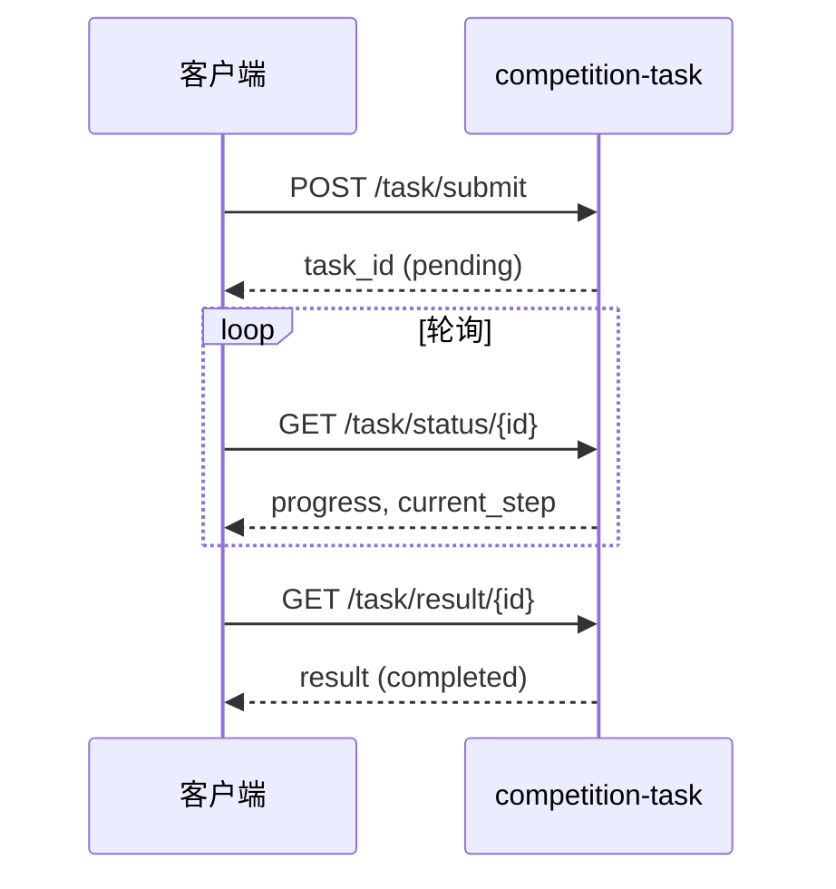

# 竞赛任务 API 说明（competition-task）

> 面向自动化评测与批量集成的一键式异步任务接口。在线 OpenAPI：`http://127.0.0.1:8080/docs`（标签 **competition-task**）；分组说明见启动后 `/openapi.json` 或 [部署与运行说明.md](./部署与运行说明.md) §6。

## 公网暴露范围

生产/公网实例请设置 `API_EXPOSE_SCOPE=competition`（仅本页三端点 + `GET /health`）或 `demo`（另开放 `structuring/modes`、`parsing/parse`、`super-agent/capabilities`）。其余 API 仅内网或带 `INTERNAL_API_TOKEN` 的请求头（`X-Internal-Request` / `X-Internal-Token`）可访问；`/docs`、`/openapi.json` 在 `competition`/`demo` 下同样仅内网。

公网 `submit` 仅允许 `documents[].content_type=base64`（禁止 `path`/`url`，防 SSRF）；内网客户端可用 `path`。

## 认证

除 `GET /health` 外，所有业务端点需携带与 `.env` 中 `API_TOKEN` 一致的令牌（**公网务必更换**默认 `dev-token-change-me`）。两种方式等价：

| 方式 | Header |
| --- | --- |
| Bearer | `Authorization: Bearer {API_TOKEN}` |
| API Key | `X-API-Key: {API_TOKEN}` |

缺失或错误令牌返回 **401**，body 示例：`{"detail":"Invalid or missing API token"}`。

## 端点一览

| 方法 | 路径 | 说明 |
| --- | --- | --- |
| POST | `/api/v1/task/submit` | 提交文档，返回 `task_id` |
| GET | `/api/v1/task/status/{task_id}` | 轮询进度、当前步骤、场景与 parser 轨迹 |
| GET | `/api/v1/task/result/{task_id}` | 任务完成后获取结构化审查结果 |

内部走 Review-Plus workflow；对外仅暴露上述三端点。

---

## POST `/api/v1/task/submit`

### 请求体（`application/json`）

| 字段 | 类型 | 必填 | 默认 | 说明 |
| --- | --- | --- | --- | --- |
| `task_description` | string | 是 | — | 任务描述 |
| `documents` | array | 是 | `[]` | 文档列表，至少 1 项 |
| `documents[].file_name` | string | 是 | — | 文件名 |
| `documents[].content_type` | string | 否 | `base64` | `path` \| `base64` \| `url` |
| `documents[].content` | string | 是 | — | 路径、Base64 或 URL |
| `documents[].role_hint` | string | 否 | — | 材料角色提示 |
| `processing_mode` | string | 否 | `OPTIMAL` | 解析处理模式 |
| `output_format` | string | 否 | `json` | 输出格式 |
| `output_schema` | string | 否 | — | 可选 schema 名 |
| `package_id` | string | 否 | — | 文档包标识（多包场景） |
| `use_dag` | boolean | 否 | `false` | 是否经共享 DAG 管道（部分场景忽略） |

### curl 示例（单 PDF，`content_type=path`）

```bash
export TOKEN=dev-token-change-me
export BASE=http://127.0.0.1:8080
PDF="$(pwd)/提交材料/示例/02-PDF验收解析/测试数据/CMG50_验收报告.pdf"

curl -s -X POST "$BASE/api/v1/task/submit" \
  -H "Authorization: Bearer $TOKEN" \
  -H "Content-Type: application/json" \
  -d "{
    \"task_description\": \"解析 CMG50 验收报告（脱敏样例）\",
    \"documents\": [{
      \"file_name\": \"CMG50_验收报告.pdf\",
      \"content_type\": \"path\",
      \"content\": \"$PDF\"
    }]
  }"
```

### curl 示例（四文件文档包，示例 04 测试数据）

```bash
FIX="$(pwd)/提交材料/示例/04-规划与编排/测试数据"

curl -s -X POST "$BASE/api/v1/task/submit" \
  -H "Authorization: Bearer $TOKEN" \
  -H "Content-Type: application/json" \
  -d "{
    \"task_description\": \"月兔一号飞轮文档包审查\",
    \"package_id\": \"q1_yutu1\",
    \"documents\": [
      {\"file_name\": \"月兔一号_产品保证检查单.docx\", \"content_type\": \"path\", \"content\": \"$FIX/月兔一号_产品保证检查单.docx\"},
      {\"file_name\": \"月兔一号_飞轮研制任务书.docx\", \"content_type\": \"path\", \"content\": \"$FIX/月兔一号_飞轮研制任务书.docx\"},
      {\"file_name\": \"月兔一号_飞轮设计分析报告.docx\", \"content_type\": \"path\", \"content\": \"$FIX/月兔一号_飞轮设计分析报告.docx\"},
      {\"file_name\": \"月兔一号_文档检查需求.xlsx\", \"content_type\": \"path\", \"content\": \"$FIX/月兔一号_文档检查需求.xlsx\"}
    ]
  }"
```

### 成功响应（HTTP 200）

```json
{
  "code": 200,
  "success": true,
  "message": "ok",
  "data": {
    "task_id": "550e8400-e29b-41d4-a716-446655440000",
    "status": "pending",
    "created_at": "2026-05-29T08:00:00+00:00"
  }
}
```

### 错误响应

| HTTP | 场景 | 示例 |
| --- | --- | --- |
| 401 | 未认证 | `{"detail":"Invalid or missing API token"}` |
| 200 + `success: false` | `documents` 为空 | `{"code":400,"success":false,"message":"documents is required"}` |

---

## GET `/api/v1/task/status/{task_id}`

### curl

```bash
TASK_ID="<submit 返回的 data.task_id>"
curl -s "$BASE/api/v1/task/status/$TASK_ID" \
  -H "Authorization: Bearer $TOKEN"
```

### 成功响应字段（`data`）

| 字段 | 类型 | 说明 |
| --- | --- | --- |
| `task_id` | string | 任务 ID |
| `status` | string | `pending` \| `running` \| `completed` \| `failed` \| `cancelled` |
| `progress` | float | 0.0–1.0 |
| `current_step` | string | 当前步骤名 |
| `scenario` | string | 如 `single_doc_parse`、多文件包审查场景等 |
| `parser_trace` | array | 解析器选择与降级轨迹 |
| `error` | string \| null | 失败时的错误信息 |
| `created_at` / `started_at` / `completed_at` | string | ISO 时间戳 |

### 典型响应片段

```json
{
  "code": 200,
  "success": true,
  "message": "ok",
  "data": {
    "task_id": "550e8400-e29b-41d4-a716-446655440000",
    "status": "running",
    "progress": 0.45,
    "current_step": "document_parsing",
    "scenario": "package_review",
    "parser_trace": [],
    "error": null,
    "created_at": "2026-05-29T08:00:00+00:00",
    "started_at": "2026-05-29T08:00:01+00:00",
    "completed_at": null
  }
}
```

### 错误响应

| HTTP | 场景 |
| --- | --- |
| 401 | 未认证 |
| 404 | `task not found` |

---

## GET `/api/v1/task/result/{task_id}`

### curl（轮询直至完成）

```bash
TASK_ID="<submit 返回的 data.task_id>"
until curl -sf -o /tmp/result.json -w "%{http_code}" "$BASE/api/v1/task/result/$TASK_ID" \
  -H "Authorization: Bearer $TOKEN" | grep -q 200; do sleep 2; done
python3 -m json.tool /tmp/result.json
```

未完成时返回 **409**：`{"detail":"task not completed yet"}`。

### 成功响应（`data`，摘要）

| 字段 | 说明 |
| --- | --- |
| `status` | `completed` 或 `failed` |
| `result.materials` | 各材料解析状态与 bundle 摘要 |
| `result.check_items` | 检查项列表（多文件包） |
| `result.findings` | 审查发现 |
| `result.review_report_markdown` | Markdown 审查报告 |
| `result.review_conclusion` | 审查结论摘要 |
| `result.cross_package_compare` | 跨包对比（跨包场景，可选） |

具体字段随 `scenario` 与材料数量变化；实现见 `data_agent/services/document_task_service.py`。

### 错误响应

| HTTP | 场景 |
| --- | --- |
| 401 | 未认证 |
| 404 | 任务不存在 |
| 409 | 任务尚未 `completed` / `failed` |

---

## 推荐调用顺序



## 与 Review-Plus / Super Agent 的关系

- **竞赛 API**：一次提交、轮询结果，适合评测脚本。
- **Review-Plus**（`/api/v1/review-plus/reviews/*`）：分步上传、门禁、多步审查 workflow（多 Agent 协同），见启动后 `/docs` 中 **review-plus** 标签。
- **Super Agent**（`/api/v1/super-agent/runs`）：统一门面与路由，示例 03 跨文档路径见 [示例/03-跨文档指代/README.md](./示例/03-跨文档指代/README.md)。

## 代码索引

| 模块 | 路径 |
| --- | --- |
| 路由 | `data_agent/api/task_router.py` |
| 请求/响应模型 | `data_agent/api/schemas.py` |
| 任务队列 | `data_agent/core/task_queue.py` |
| 执行逻辑 | `data_agent/services/document_task_service.py` |
| 集成测试 | `tests/test_task_api.py` |
