面向GNC设计要素审查的数据智能体技术报告

# **1 项目概述**

## **1.1 建设背景**

GNC分系统承担姿态确定、姿态控制、轨道控制、故障处置和任务模式管理等职责，是型号任务能力形成、在轨运行安全和工程风险控制的重要组成。GNC设计审查贯穿方案论证、设计报告定稿、关键节点评审、验证确认和质量问题归零等环节，审查对象具有材料类型多、信息密度高、跨材料关系复杂、专业判断责任重等特征。

传统GNC分系统评审通常需要集中姿态确定、姿态控制、FDIR、接口、验证等多个方向的专家，并在有限时间内完成数百页送审材料的审阅、问题识别和意见归并。多型号并行研制条件下，专家排期、材料准备、跨文档核查和证据归档成为制约评审效率和评审质量的重要因素。

本数据智能体研制目标并非建设单一文档问答工具，也并非仅对PDF进行解析展示，而是围绕GNC设计要素审查业务，形成可进入评审准备、专业审查、质量产保自查和问题闭环的智能辅助审查能力。

## **1.2 业务需求与建设必要性**

GNC设计要素审查的业务需求集中体现在审查效率、审查质量、证据链完整性、领域专业适配和复杂文档处理五个方面。数据智能体应将专家从重复性阅读、材料整理、条目匹配和证据定位工作中释放出来，使专家重点投入方案合理性、风险接受性和型号放行等高价值判断。

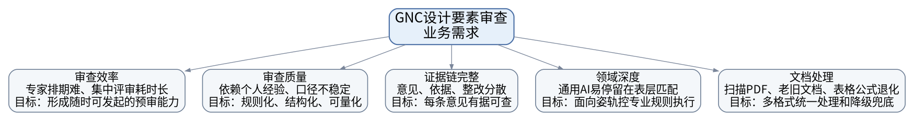

图1-1 GNC设计要素审查业务需求图谱

表1-1 GNC设计要素审查业务需求与建设要求

| **业务需求** | **传统方式主要问题** | **数据智能体建设要求** |
| --- | --- | --- |
| 审查效率 | 专家资源稀缺，集中评审排期困难；材料阅读和摘录耗时长。 | 支持随时发起预审，将材料整理、缺项检查、证据定位等前置自动完成。 |
| 审查质量 | 审查深度受个人经验、时间压力和注意力影响，口径不易统一。 | 形成规则化、结构化、可复核的审查过程，降低系统性漏审风险。 |
| 证据链完整 | 意见、依据、整改和纪要分散，问题归零和复查困难。 | 建立Evidence—Finding—RID—Minutes—Decision的闭环证据链。 |
| 领域深度适配 | 通用AI易停留在表层语义匹配，专业判断可信度不足。 | 以GNC专业规则、审查单元和结构化输出约束支撑专业审查。 |
| 文档解析能力 | 老旧文档、扫描PDF、复杂表格和公式容易导致格式退化。 | 建立多格式解析、版面分析、表格结构化、公式抽取和降级兜底机制。 |

## **1.3 审查业务对象**

本数据智能体面向GNC分系统设计过程中的送审材料、设计要素、审查规则和问题闭环信息开展智能辅助审查。审查对象不是单一文档，而是由任务书、总体方案、GNC设计报告、接口控制文件、仿真验证材料、技术方案检查单、质量产保自查材料和历史评审问题构成的送审包。

表1-2 GNC设计要素审查业务对象

| **对象类别** | **主要内容** | **审查关注点** |
| --- | --- | --- |
| 送审材料 | 任务书、总体方案、GNC设计报告、ICD、仿真报告、检查单、自查表、历史问题。 | 材料是否齐套、版本是否明确、角色是否清晰、是否具备审查依据。 |
| 设计要素 | 任务要求、总体约束、方案配置、模型算法、指标参数、公式符号、验证确认、质量闭环。 | 要求是否承接、方案是否完整、参数是否一致、验证是否闭合。 |
| 审查规则 | 检查单条款、章节模板、专业审查规则、历史问题经验、规范条款。 | 条款是否逐项响应，问题判断是否有据可查。 |
| 审查输出 | 缺项清单、问题建议、证据定位、审查意见单、评审纪要、结论草稿。 | 是否便于专家复核、整改闭环和质量归档。 |

## **1.4 数据智能体建设目标**

数据智能体建设目标是形成面向GNC设计要素审查的智能辅助能力体系，支撑评审前准备、设计报告复查、文文一致性审查、质量产保自查和问题闭环管理。建设目标应围绕“材料可处理、流程可执行、问题可追溯、结论可复核、知识可沉淀”展开。

表1-3 数据智能体建设目标

| **建设目标** | **能力要求** | **主要输出** |
| --- | --- | --- |
| 材料统一处理 | 支持PDF、Word、Excel、文本、Markdown等材料解析，复杂PDF具备增强解析和降级兜底。 | 结构化送审材料、章节结构、解析异常清单。 |
| 缺项与齐套检查 | 识别材料缺项、章节缺项、参数缺项、依据缺项和解析质量问题。 | 齐套性判定、缺项清单、补充材料建议。 |
| 设计要素审查 | 提取任务要求、参数、公式、接口、验证项和质量闭环信息。 | 设计要素清单、检查单响应状态、问题候选。 |
| 多专业协同核查 | 按姿态确定、姿态控制、FDIR、接口、验证充分性、跨文档一致性等维度组织审查。 | 专业审查发现、合稿问题清单、待专家确认项。 |
| 证据链与闭环 | 每条意见绑定原文位置、审查依据、问题描述、整改建议和关闭状态。 | 审查意见单、评审纪要、闭环追溯记录。 |
| 知识资产沉淀 | 沉淀专业规则、历史问题、典型缺陷和跨型号复用经验。 | 规则库、问题库、型号审查知识资产。 |

## **1.5 当前能力边界与阶段效益**

当前数据智能体已具备多格式材料解析、结构化底稿生成、送审包齐套性检查、GNC审查流程编排、问题建议生成、证据定位、运行过程留痕和质量评测等主链路能力。常规PDF、Word、Excel和文本材料可进入自动化处理；扫描PDF、复杂跨页表格、图片型公式、工程图和低质量版面仍需解析增强和人工复核。

在齐套材料、标准模板和明确审查范围条件下，数据智能体可将审查前准备、材料整理、证据定位和初步问题生成压缩至小时级，使专家重点转向高价值判断。该效益应界定为“评审前辅助预审效率提升”，不应表述为替代正式评审组织或替代专家终审。

表1-4 当前能力边界与阶段效益

| **能力项** | **当前状态** | **边界说明** |
| --- | --- | --- |
| 专业审查单元 | 按33个细分审查智能体/审查单元进行能力设计，覆盖六大GNC审查维度。 | 可分阶段装配；重大专业判断需专家确认。 |
| 全流程审查 | GNC十步流程、文文一致性审查和通用智能审查可通过统一入口组织。 | 正式评审结论仍由专家和评审组织形成。 |
| 文档解析 | 以基础解析和结构化底稿为主，MinerU增强解析具备接口设计、数据流规划和降级策略。 | 关键参数、公式和图表内容需保留原文并复核。 |
| 审查质量 | 规则化、结构化、可追溯输出降低漏审风险。 | 不对方案合理性、风险接受和型号放行作自动裁决。 |

# **2 GNC设计要素审查业务分析**

## **2.1 送审材料构成**

GNC设计审查通常面向送审包开展综合核查。送审包至少应包括任务输入、被审设计报告、接口或验证材料、检查单或质量自查材料。材料齐套程度直接决定审查能否进入深度核查。

表2-1 送审材料构成与缺失影响

| **送审包角色** | **典型材料** | **缺失影响** |
| --- | --- | --- |
| 任务依据 | 任务书、研制要求、载荷任务要求。 | 无法判断设计是否承接任务要求。 |
| 被审对象 | GNC设计报告、姿态确定/姿态控制设计说明。 | 无法开展设计要素核查。 |
| 接口依据 | ICD、遥测遥控定义、总线通信约束。 | 接口一致性和跨专业协同无法核查。 |
| 验证依据 | 仿真报告、试验报告、验证计划和结果表。 | 验证充分性和设计闭合无法判定。 |
| 检查单与质量材料 | 技术方案检查单、质量产保自查表、评审问题清单。 | 检查单响应和问题闭环无法核查。 |
| 历史参照 | 历史问题、典型缺陷、归零记录。 | 同类问题复用不足，经验传承不充分。 |

## **2.2 审查流程**

GNC设计要素审查可按“接收—结构化—门控—提取—匹配—核查—合稿—审定—确认—闭环”组织。数据智能体在该流程中承担材料预处理、缺项检查、设计要素抽取、证据定位和问题草稿生成职责；专家承担专业裁定、风险接受和正式结论确认职责。

图2-1 GNC设计要素审查业务流程

表2-2 GNC设计要素审查流程与智能体参与程度

| **步骤** | **业务名称** | **数据智能体参与程度** |
| --- | --- | --- |
| 1 | 任务输入 | 自动接收与登记，形成型号、阶段、范围和材料上下文。 |
| 2 | 材料解析 | 自动解析多格式材料，形成结构化审查底稿。 |
| 3 | 缺项检查 | 自动预检材料、章节、参数和依据缺项，质量师确认。 |
| 4 | 设计要素提取 | 自动提取任务要求、参数、公式、接口和验证项候选。 |
| 5 | 审查条目匹配 | 将检查单、规则、任务要求匹配到材料证据。 |
| 6 | 专业核查 | 按姿态确定、姿态控制、FDIR、接口、验证等维度生成问题建议。 |
| 7 | 合稿归并 | 问题去重、分级、归并，形成意见单和纪要草稿。 |
| 8 | 总师审定 | 数据智能体提供依据，总师和专家作最终判断。 |
| 9 | 专家确认 | 对待确认项、重大问题和风险接受事项人工裁定。 |
| 10 | 问题闭环 | 辅助记录整改、复查和关闭状态，形成历史问题资产。 |

## **2.3 人工审查痛点**

GNC设计审查的现实痛点不只体现为“材料多”，更体现为专家资源稀缺、专业判断难统一、跨文档一致性难核查、验证充分性难量化和历史知识难复用。上述痛点共同决定了数据智能体必须围绕业务流程建设，而不能停留在通用问答或简单OCR层面。

表2-3 人工审查痛点与业务影响

| **痛点** | **典型表现** | **业务影响** |
| --- | --- | --- |
| 审查时间长、专家资源稀缺 | 一次GNC评审往往需要多方向专家集中审阅数百页材料，多型号并行时排期冲突突出。 | 关键节点评审准备周期长，专家大量时间消耗在重复阅读和材料比对上。 |
| 审查深度依赖个人经验 | 新晋专家可能遗漏隐蔽问题，不同专家判断口径存在差异，长时间评审后漏检风险增加。 | 审查质量不稳定，问题发现依赖个人经验积累。 |
| 跨文档一致性核查不足 | 设计报告、ICD、仿真报告和试验报告由不同团队维护，参数和版本容易不同步。 | 接口类问题和参数不一致问题可能延后暴露，归零成本增加。 |
| 验证充分性难以量化 | 设计指标与验证条目缺少显式映射，极限、故障和组合工况覆盖盲区难系统识别。 | 无法充分回答“哪些设计要求已验证、哪些工况未覆盖”。 |
| 专家经验断层和知识孤岛 | 关键设计准则、历史教训和边界工况识别经验分散在个人经验和型号材料中。 | 新晋工程师学习周期长，历史问题跨型号复用不足。 |

## **2.4 传统AI方案适用边界与技术挑战**

传统AI方案直接用于GNC设计审查存在明显边界。审查工作要求专业判断可信、上下文关系完整、多专业意见可协同、每条意见有依据可查。仅依靠通用大模型问答或切块检索，难以满足航天评审对专业性、可追溯性和责任边界的要求。

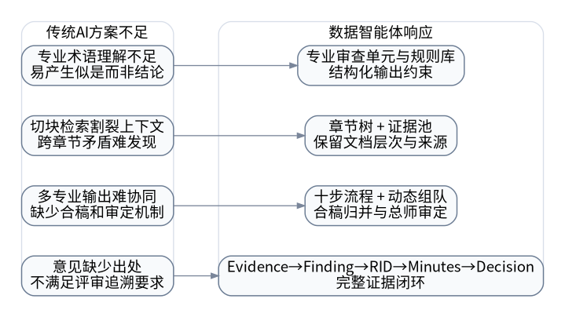

图2-2 传统AI方案挑战与数据智能体响应关系

表2-4 传统AI方案挑战与数据智能体响应

| **技术挑战** | **传统方案不足** | **本数据智能体响应** |
| --- | --- | --- |
| 专业理解不足 | 通用AI对“三正二斜布局”“磁力矩器卸载”“卡尔曼滤波姿态确定”等术语易作表层匹配。 | 通过专业审查单元、规则库和结构化输出约束固化GNC审查知识。 |
| 上下文割裂 | 切块检索容易切断章节层级和跨章节逻辑，难发现参数、指标、验证结论之间的矛盾。 | 采用章节结构和证据集合保留文档层次，支撑跨章节、跨文档核查。 |
| 多专业协同不足 | 多个AI模块并列输出易各说各话，缺少合稿和审定机制。 | 通过GNC十步流程、动态专家组队和总师审定组织多专业协同。 |
| 证据链不足 | 通用AI结论往往说不清依据来源，不满足审查意见可追溯要求。 | 每条问题建议绑定原文位置、规范条款或历史参照，形成闭环证据链。 |
| 复杂格式退化 | 老旧文档、扫描PDF、跨页表格和图片公式易导致解析失败。 | 采用多级解析、MinerU增强接口设计、表格/公式处理和降级兜底机制。 |

## **2.5 证据链与审查合法性要求**

航天工程评审强调“意见必须有依据”。无法说明来源页码、原文片段、规范条款或历史问题参照的意见，不宜作为正式审查发现进入问题归零流程。数据智能体应将证据组织作为审查主线，而非在生成结论后再补充出处。

图2-3 审查证据链闭环关系

证据链按审查依据、审查发现、审查意见单、评审纪要、放行或整改结论、整改复查闭环组织。该链路既服务专家复核，也服务设计单位整改、质量人员归档和后续跨型号知识复用。

## **2.6 业务需求归纳**

综上，面向GNC设计要素审查的数据智能体应首先满足业务需求，而后再选择模型、工具和编排方式。业务需求可归纳为六类：材料可处理、缺项可发现、规则可执行、问题可定位、结论可复核、知识可沉淀。

表2-5 业务需求归纳与对应能力

| **业务需求** | **具体要求** | **对应能力** |
| --- | --- | --- |
| 材料可处理 | 支持多格式、退化格式和复杂版面处理。 | 格式识别、解析分流、结构化底稿、降级兜底。 |
| 缺项可发现 | 识别材料、章节、参数、验证和依据缺失。 | 送审包齐套性检查、模板章节检查、参数候选检查。 |
| 规则可执行 | 检查单、专业规则和历史问题可被机器执行。 | 规则库、专业审查单元、结构化输出约束。 |
| 问题可定位 | 每条问题对应原文位置、依据摘录和触发规则。 | 证据池、追溯矩阵、Evidence-Finding绑定。 |
| 结论可复核 | 系统输出为草稿和建议，重大判断进入专家确认。 | 置信度控制、待确认项、总师审定和人工复核。 |
| 知识可沉淀 | 历史问题、整改措施和审查经验可跨型号复用。 | 问题库、规则库、知识资产和闭环归档。 |

# **3 数据智能体能力总体说明**

数据智能体能力按“业务问题—数据智能体能力—输出结果—技术支撑”组织。核心能力包括送审材料接收、材料完整性检查、文档结构化处理、审查依据关联、审查任务分解与执行、问题识别与结论草稿生成。

表3-1 数据智能体核心能力

| **能力** | **主要内容** | **输出** |
| --- | --- | --- |
| 材料接收 | 识别材料类型和角色，登记任务上下文 | 材料清单、角色识别结果、待确认清单 |
| 完整性检查 | 检查材料、章节、参数、依据和解析质量缺项 | 齐套性判定、缺项清单、补充建议 |
| 结构化处理 | 恢复章节、表格、公式、图片、参数和来源位置 | 结构化底稿、章节结构、证据集合 |
| 依据关联 | 将问题建议绑定文件、章节、页码、摘录和设计要素 | 证据定位、候选追溯矩阵 |
| 任务执行 | 按GNC十步或文件组流程组织审查步骤 | 执行计划、专业核查结果、运行日志 |
| 结论生成 | 形成问题建议、审查意见单和结论草稿 | 问题清单、意见单草稿、待确认项 |

## **3.1 总体架构与技术路线**

技术路线坚持业务流程牵引、通用能力支撑、领域装配落地、过程质量闭环。前端和接口层负责接收送审任务；材料理解层将多格式材料转换为结构化底稿；通用智能体层负责格式自愈、指代消解、任务规划、工具调用和质量评测；领域装配层负责GNC审查、文文一致性审查和通用智能审查路径；持久化层保存材料、运行轨迹、检查点、审查结果和知识资产。

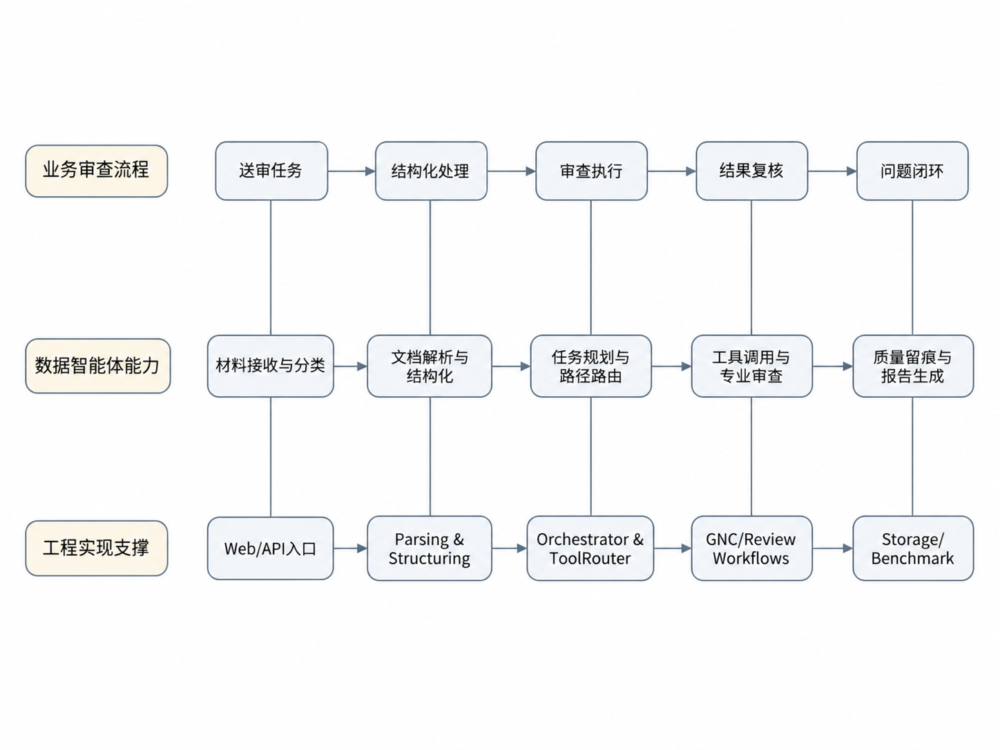

图3-1 三层技术路线与能力映射关系

# **4 典型审查流程**

典型流程以结构化底稿为基础开展。任务输入阶段明确型号、评审阶段、审查范围、材料清单、检查单和输出要求；材料解析阶段完成格式识别、解析分流和结构化；缺项检查阶段识别材料缺项、章节缺项、参数缺项、依据缺项和解析质量问题；设计要素提取阶段形成任务要求、总体约束、方案配置、指标参数、公式符号、验证项和质量闭环条目；审查条目匹配阶段将检查单、规则和任务要求映射到证据位置；问题发现阶段形成设计缺项、指标不一致、参数来源不清、验证支撑不足、接口约束不一致和闭环不完整等建议；结论生成阶段形成审查意见单、纪要和待确认项；问题经专家确认后进入整改、复查、关闭和历史问题库沉淀。

图4-1 审查问题闭环链路

# **5 面向GNC设计要素审查的数据智能体技术实现方案**

面向GNC设计要素审查的数据智能体，围绕航天GNC送审材料的智能化处理与辅助审查任务构建，形成“材料接入、场景识别、文档解析、文档审查、结果生成”的闭环处理链路。系统以送审材料包为输入，以结构化审查底稿为中间载体，以GNC设计要素审查、文件组/文文一致性审查、智能通用化审查三类审查路线为执行路径，以审查发现、证据定位、结论草稿和问题闭环材料为输出成果。

数据智能体采用通用数据处理能力与GNC领域审查能力分层解耦的技术架构。通用能力负责材料接收、多格式解析、结构化表达、任务规划、工具调用、质量评测和过程留痕；领域能力负责GNC设计要素体系、专业审查规则、检查单条目、跨文档一致性关系、审查问题表达和结论草稿生成。五环节处理链路贯穿前端工作台、接口服务、任务编排、材料理解、审查工作流和质量保障各技术层级。

## **5.1 五环节闭环处理链路**

智能审查工作台的运行链路由上传材料、识别与路由、文档解析、文档审查、审查结果五个环节构成。上传材料环节建立任务上下文和原始材料包；识别与路由环节完成材料角色识别、审查场景判定和处理路线选择；文档解析环节形成章节结构、证据集合和结构化底稿；文档审查环节按三类路线执行专业核查、跨文档核查或通用核查；审查结果环节完成问题归并、证据绑定、结论草稿和闭环材料生成。

该处理链路与实际智能审查工作台的运行状态一致，体现材料进入、任务识别、底稿形成、审查分发和结果归并之间的连续关系。各技术组件均服务于该链路，不形成脱离审查流程的独立技术堆叠。

图5-1 智能审查五环节处理链路

表5-1 五环节闭环处理链路说明

| **处理环节** | **核心目标** | **主要产物** |
| --- | --- | --- |
| 上传材料 | 接收送审材料并建立运行上下文 | run\_id、材料清单、原始材料包 |
| 识别与路由 | 判断材料角色和审查场景，确定处理路线 | 路由结果、审查任务板、执行计划 |
| 文档解析 | 形成结构化底稿和证据集合 | 章节结构、证据池、设计要素候选 |
| 文档审查 | 按三类路线执行审查并形成发现 | 问题候选、差异项、证据结果 |
| 审查结果 | 合稿归并并形成结论草稿和闭环材料 | 问题清单、结论草稿、质量报告 |

## **5.2 总体技术架构**

数据智能体总体架构由工作台与接口、通用能力、领域装配、质量保障和运行存储构成。工作台与接口提供任务提交、状态展示和结果查阅能力；通用能力承担任务编排、材料理解和质量保障；领域装配承载GNC设计要素审查、文件组/文文一致性审查和智能通用化审查；运行存储保存材料、底稿、审查发现、质量报告和过程Trace。

通用能力与领域能力采用解耦设计。材料解析、结构化、任务规划、工具调用和质量评测不直接固化在GNC专业逻辑中；GNC专业规则、检查单、历史问题和审查模板通过领域装配层注入。该设计支撑当前GNC场景，同时为后续扩展星务、热控、电源、测控等专业保留工程接口。

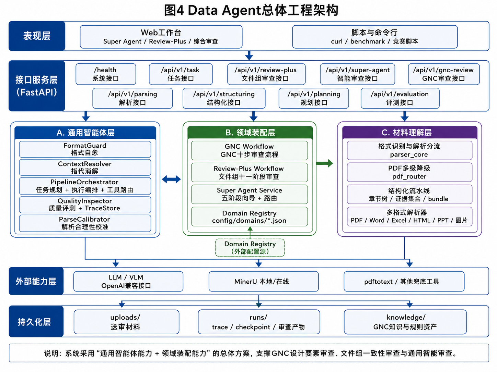

图5-2 数据智能体总体技术架构

表5-2 数据智能体总体架构层次

| **层次** | **主要组成** | **作用** |
| --- | --- | --- |
| 工作台与接口 | 智能审查工作台、任务接口、Super Agent接口、解析接口、审查接口 | 支撑任务提交、状态流转、结果查看 |
| 通用能力 | 任务编排、格式识别、解析降级、章节树、证据集合、质量评测 | 支撑五环节处理链路 |
| 领域装配 | GNC审查、文件组一致性审查、通用审查、规则和模板 | 支撑三类审查路线执行 |
| 运行存储 | uploads、runs、结构化底稿、审查发现、报告和Trace | 支撑归档、复现和审计 |

## **5.3 任务对象与数据对象设计**

数据智能体以统一数据对象贯穿五环节处理链路。任务对象记录运行编号、型号阶段、审查范围和用户输入；材料对象记录文件、格式、来源和角色候选；路由对象记录场景、路线和执行约束；结构化底稿对象记录章节、表格、公式、图片、证据和要素候选；审查计划对象记录路线、节点、工具和规则；审查发现对象记录问题、证据和置信状态；审查结果对象记录结论草稿、闭环材料和质量报告。

对象设计遵循来源可定位、状态可追踪、结果可复核的原则。每个审查发现均应能够回溯到原始材料和证据位置；每个执行节点均应保留完成、失败、降级、待确认等状态；每个结论草稿均应保留证据对象和人工确认标识。

图5-3 运行对象与数据对象传递关系

表5-3 任务对象与数据对象设计

| **对象** | **形成环节** | **关键字段** | **作用** |
| --- | --- | --- | --- |
| 任务对象 | 上传材料 | run\_id、型号、阶段、范围 | 全流程上下文 |
| 材料对象 | 上传材料 | 文件名、格式、来源、角色候选 | 材料管理和分类 |
| 路由对象 | 识别与路由 | 场景、路线、执行约束 | 确定处理路径 |
| 结构化底稿 | 文档解析 | 章节、证据、参数、公式、图片 | 支撑审查执行 |
| 审查发现 | 文档审查 | 问题、证据、状态、确认标识 | 支撑合稿归并 |
| 审查结果 | 审查结果 | 结论草稿、闭环材料、质量报告 | 支撑专家复核 |

## **5.4 材料接入与任务建档**

材料接入与任务建档承担送审任务进入系统的基础功能。系统接收审查任务说明、型号阶段、审查范围和材料包，生成运行编号，并将材料保存到任务目录。该环节将零散文件转换为可被后续流程统一处理的任务对象和材料对象。

材料接入应覆盖任务书、GNC设计报告、接口控制文件、仿真验证报告、技术方案检查单、质量产保自查表、评审问题清单、整改记录等材料类型。系统对文件格式、文件大小、可读性、重复文件和空文件进行初始检查，并记录材料来源、上传时间和任务关联关系。

表5-4 材料接入与任务建档工作项

| **工作项** | **实现内容** | **输出** |
| --- | --- | --- |
| 任务建档 | 生成运行编号，记录型号、阶段、审查范围和任务说明 | 任务对象 |
| 材料接收 | 保存PDF、Word、Excel、图片、文本等材料 | 原始材料包 |
| 材料登记 | 记录文件名、格式、大小、来源和上传时间 | 材料清单 |
| 初始校验 | 检查文件可读性、重复状态和空文件 | 初始质量状态 |
| 上下文绑定 | 将任务信息与材料清单关联 | 全流程运行上下文 |

## **5.5 场景识别与审查路由**

场景识别与审查路由用于确定任务处理方式。系统根据材料数量、文件名、材料角色、内容摘要、显式任务说明、用户指定范围和解析后结构化信息，判定任务进入GNC设计要素审查、文件组/文文一致性审查或智能通用化审查。

路由过程采用解析前粗判和解析后修正相结合的方式。解析前路由用于选择初始解析策略和候选审查路径；解析后路由结合章节结构、材料内容、检查单条目和领域信号，对审查路线、专业单元和工具调用计划进行修正。

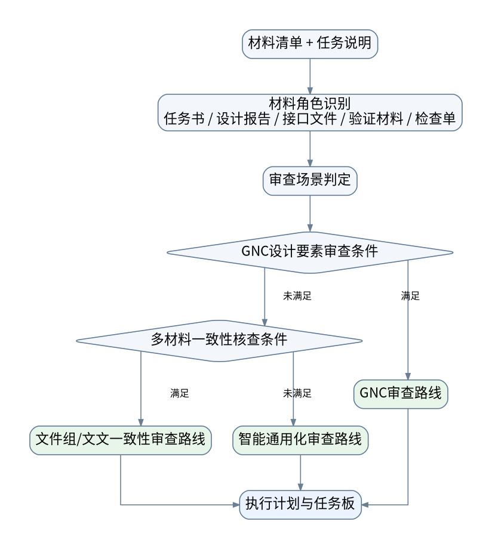

图5-4 场景识别与路由机制

表5-5 审查路线触发条件与处理策略

| **审查路线** | **触发条件** | **处理策略** |
| --- | --- | --- |
| GNC设计要素审查 | 材料明确指向GNC设计报告、GNC方案或姿轨控专业审查 | 调用GNC设计要素审查工作流 |
| 文件组/文文一致性审查 | 多份材料之间需要要求、设计、接口、验证和检查单一致性核查 | 调用文件组/文文一致性审查工作流 |
| 智能通用化审查 | 材料不齐、目标不标准、未命中专用规则或需要探索性处理 | 调用通用任务规划和通用审查流程 |

## **5.6 文档解析与结构化底稿构建**

在 GNC 设计要素审查的复杂业务场景中，送审包通常包含多份、多格式、版面复杂文件组，涉及的文件类型包括Word、Excel、PDF、图片、扫描件等。因此，文档解析与结构化底稿构建是形成审查能力的基础环节。原始送审材料不能直接支撑审查，必须转换为章节清晰、证据可定位、要素可抽取、质量可标记的结构化底稿。底稿内容包括章节结构、段落块、表格块、公式块、图片块、参数候选、设计要素候选和证据集合。

针对航天GNC相关的文档材料，我们在数据处理的过程中面临诸多主要难点：

一是复杂版面难以稳定还原，尤其横向扫描 PDF 导致参数表行序错乱、跨页表断裂和表格结构异常；

二是手写体字段在 OCR 后易出现“形似实错”（如手写符号、关键产品序号等），若未经校准即进入审批流程，会产生虚假的“不符合”结论；

三是插图与扫描图片难以获得可检索、可引用的文字依据，框图与曲线往往只能依赖人工看图，无法与章节、检查项在同一套依据池中对照。传统“全文抽取”或单一 OCR 无法同时解决上述问题，且解析失败时若不能显式降级与留痕，会拖慢整包审查并损害评审结论的可追溯性。错误示例如下图所示。

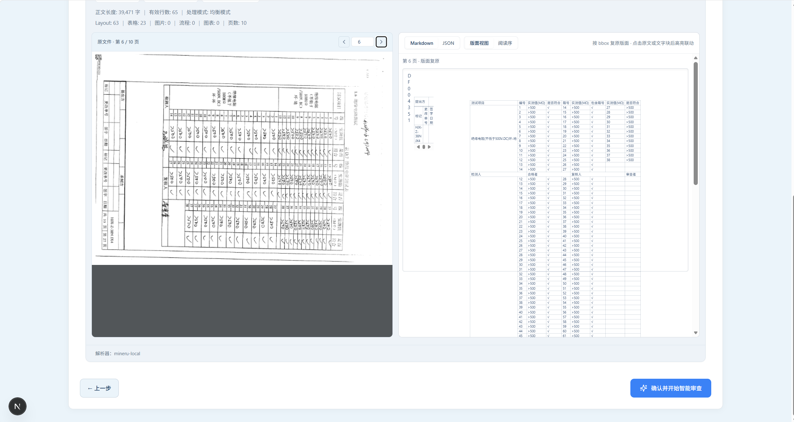

图5-5 横向文本拼接增行错误示例

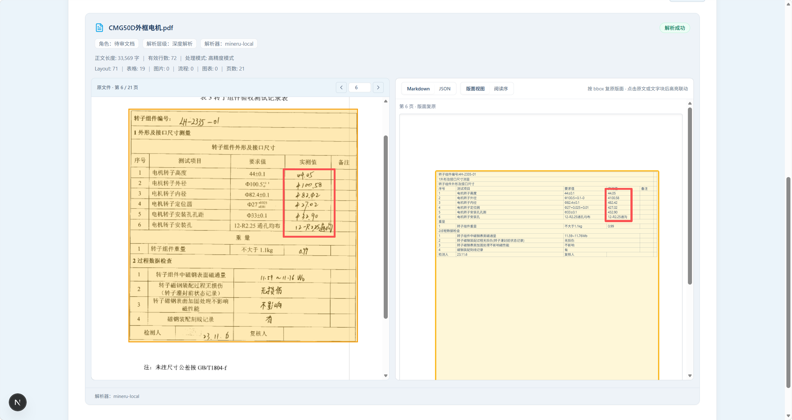

图5-6 手写体Φ识别错误示例

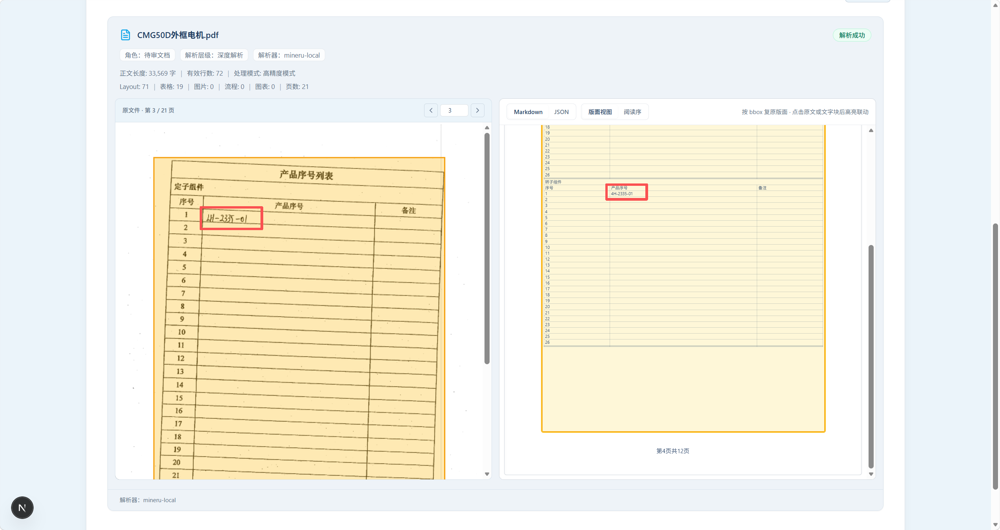

图5-7 关键字段产品序号识别错误示例

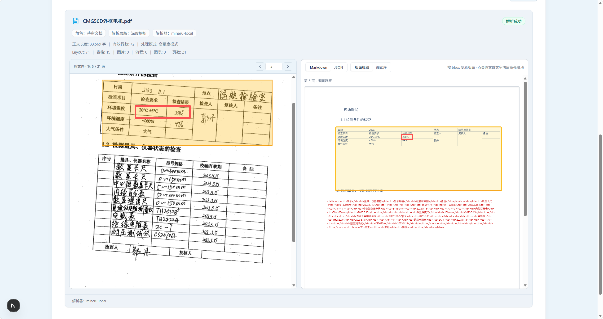

图5-8 手写体“23.8”小数点漏识别错误示例

因此，本方案结合传统文档结构化解析库和MinerU能力，形成如下文档解析多路由逻辑，并取得较稳定的工程处理效果：

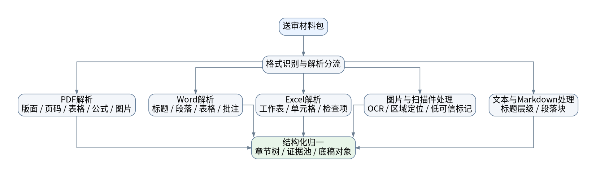

图5-9 不同类型文档解析处理关系

### **5.6.1 PDF类材料解析处理**

PDF类材料通常承载任务书、设计报告、接口文件和仿真报告，是GNC审查的主要材料类型。PDF解析处理应优先保留页码、章节、段落、表格、公式、图片和图注的版面关系。对于文字型PDF，系统进行正文抽取、章节恢复和表格识别；对于扫描PDF，系统采用OCR或外部解析能力进行图文识别；对于复杂排版PDF，系统记录低可信区域和解析降级状态。

PDF解析采用多级降级策略。高精度版面解析可用时，优先形成包含版面块的结构化对象；高精度解析失败时，切换至本地解析或文本抽取；扫描质量不足或工程图难以解析时，输出人工复核标识。

这部分是核心难点，也在后续文档解析创新处理里做详细的阐述。

### **5.6.2 Word类材料解析处理**

Word类材料通常包含设计说明、检查单、评审意见和整改记录。系统应保留标题层级、段落顺序、表格结构、批注和编号关系。对Word材料的解析重点在于恢复章节层级、抽取检查项、识别表格参数和保持原文段落可追溯。

Word材料中的表格、编号条款和批注信息是审查依据的重要来源。系统将条款编号、章节路径和表格单元格关联到证据集合，供后续规则匹配、条款响应检查和问题闭环使用。

该部分主要对Word文档中的图片增加VLM处理能力，与PDF材料中的图片处理逻辑保持一致。

### **5.6.3 Excel和表单类材料解析处理**

Excel和表单类材料主要包括检查单、自查表、问题清单和整改闭环表。系统按工作表、行列、单元格、表头和合并单元格关系进行结构化，重点识别检查条目、响应状态、责任项、问题编号、整改措施、复查结论和关闭状态。

该类材料解析的核心是保持表格语义，而不是仅抽取文本。系统需将表头与数据行建立关系，将检查项与响应内容、证据说明和闭环状态对应起来，为文文一致性审查和问题闭环提供结构化输入。

### **5.6.4 图片、扫描件与公式图表处理**

图片、扫描件和公式图表的处理以区域定位、OCR识别、低可信标记和人工复核为基本原则。系统对公式图片、趋势图、仿真曲线和工程图进行位置记录和说明性摘录，不将复杂工程图自动判读结果作为高置信结论依据。

对于公式和图表，系统应记录原文位置、图表编号、图注、关联章节和解析可信度。涉及关键公式、控制参数、仿真曲线和工程图判读的内容，应在审查结果中保留人工确认标识。

### **5.6.5 章节结构、证据集合与底稿对象构建**

不同类型材料解析结果最终统一到结构化底稿对象中。系统将章节结构、段落块、表格块、公式块、图片块和证据摘录统一编码，并建立材料来源、页码、章节路径和原文片段之间的映射关系。结构化底稿同时保存解析质量状态，用于后续审查路线判断和人工复核。

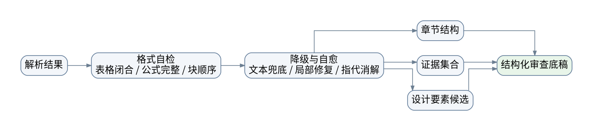

图5-10 结构化底稿构建机制

表5-6 文档解析对象与底稿产物

| **解析对象** | **处理重点** | **底稿产物** |
| --- | --- | --- |
| PDF材料 | 页码、版面、章节、表格、公式、图片位置 | 版面块、章节树、证据块 |
| Word材料 | 标题层级、段落、表格、编号、批注 | 章节块、表格块、条款块 |
| Excel/表单 | 工作表、表头、单元格、检查项、状态字段 | 检查项对象、闭环字段 |
| 图片/扫描件 | OCR、区域定位、低可信标记 | 图文证据块、复核标识 |
| Markdown/文本 | 标题层级、段落结构、代码块或列表 | 文本章节块、段落证据 |

### **5.6.6 文档解析处理创新点**

本环节的设计目标，是将复杂送审材料转化为来源可定位、字段可校验、过程可追溯的结构化材料包，为此，本方案围绕三类痛点，在MinerU原有能力上进行算法集成：

1. 阅读方向评分与扫描件方向归一化：本方法对PDF或图片逐页判断：对宽高比横版且文本稀疏的扫描页，通过行纹理、边缘对比和版心分布计算可读性得分，在90°和270°中选择最佳旋转角度；竖版页则判断0°/180°翻转，形成“先转正、再识别、再修表”的可信处理链。解决因横向打印再扫描等导致的页面朝向与阅读方向不一致问题，避免OCR和版面分析出现表格行列错位、跨页断裂等异常；

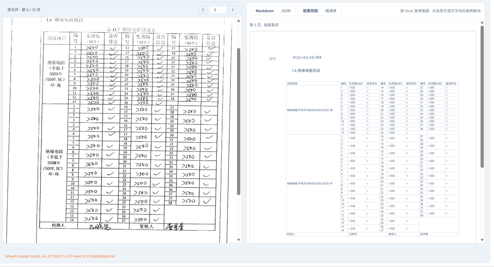

图5-11 扫描件方向归一化算法应用效果

1. 硬规则预筛与大模型解析合理性校准：为解决手写体字符错判的问题，本方法采用了硬规则预筛与大模型解析相结合的校准链路。

硬规则预筛是基于工程人员实际提取的规则，例如基于温度单位、直径符号Φ、产品序号模式等确定性规则，在全文档块级扫描，生成高召回、可解释的“待复核”候选记录，只生成怀疑清单，不对解析结果进行校正；大模型重点用于上下文结合，模型并非独立扫描全文，而是严格针对规则命中的可疑块，结合其前后若干块及同页上下文，综合判断OCR是否明显不合理（如Φ150被读成415003、序号LH被读成4H等），输出是否可疑、问题类型与复核建议，避免孤立看数字导致的误判。最终输出仅标记不修改原文，供质量筛查与专家复核使用，实现“解析风险”与“设计缺陷”分离；

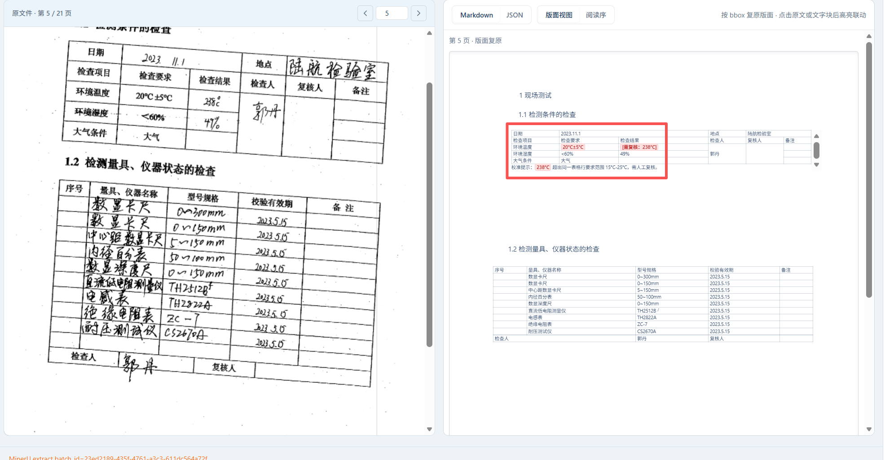

图5-12 小数点漏判合理性校准

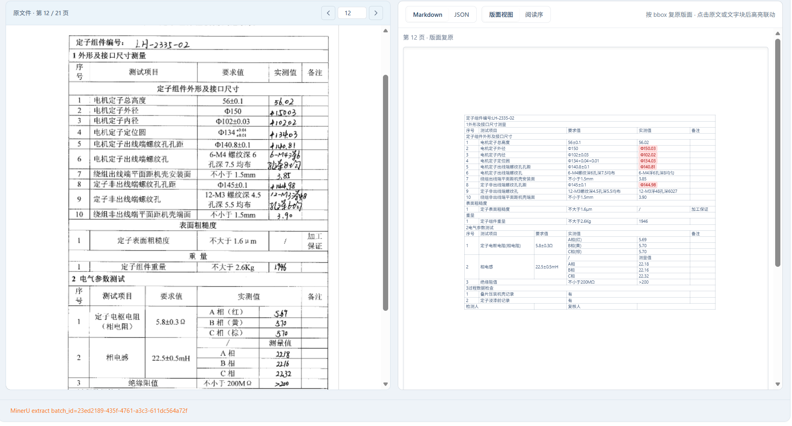

图5-13 手写体符号合理性校准

1. 多模型协同的图片语义提取：针对GNC送审材料中的控制框图、仿真曲线及扫描附图，在方向校正与正文解析之后，采用版面模型（可选）+ 轻量/主视觉语言模型（VLM）+ 备用视觉通道的分级调用策略：均衡档优先使用轻量VLM，高精度档直接用主VLM，版面模型若已提取图文则避免重复调用；VLM生成带页码、可检索的中文文字说明（含图中文字、表格、坐标轴、曲线趋势等），经无效回复过滤后写入图块的vision\_description，与正文、参数表一同汇入审查依据池。下游的齐套门控、检查单匹配、跨文档印证及意见单生成均基于这一文字层检索引用。

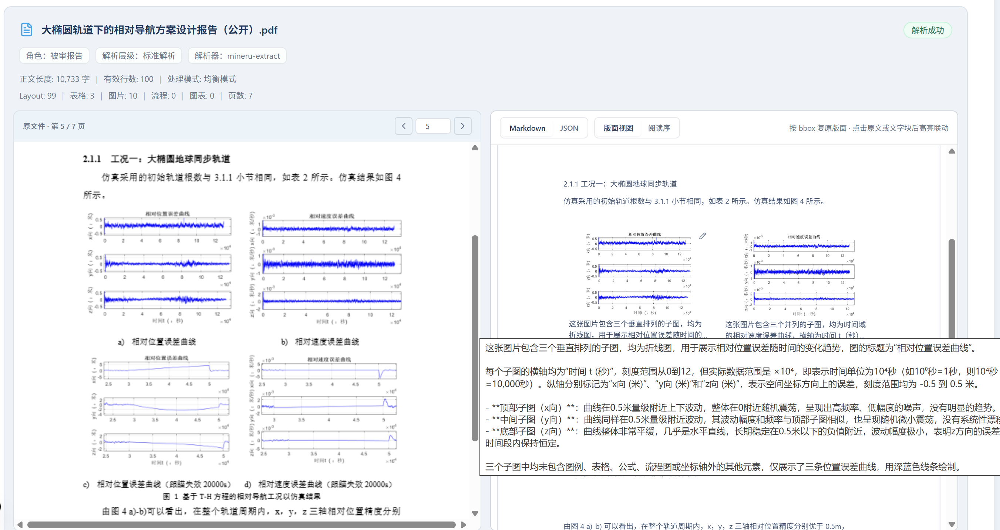

图5-14 图片解析效果图

## **5.7 文档审查执行机制**

文档审查执行机制以结构化底稿为输入，以审查任务板为调度载体，以工具调用和专业审查单元为执行方式。审查任务板根据路由结果生成，明确审查路线、规则集合、专业单元、工具清单和结果输出要求。三类审查路线共享底稿、证据集合、质量评测和运行留痕机制。

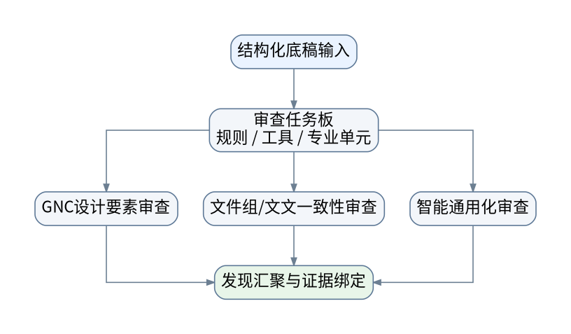

图5-15 三类文档审查处理关系

### **5.7.1 GNC设计要素审查处理**

GNC设计要素审查面向明确的GNC设计方案、设计报告和相关送审材料，重点核查任务要求承接、总体约束落实、设计方案完整性、模型算法说明、指标参数一致性、公式符号完整性、接口关系、验证闭合和质量问题闭环。

处理流程包括设计要素抽取、检查单与规则匹配、专业审查单元核查和问题归并。设计要素覆盖任务要求、总体约束、方案配置、模型算法、指标参数、公式符号、验证确认和质量闭环；专业审查单元可按质量、接口、验证、故障处置、姿态确定、姿态控制等维度组织。

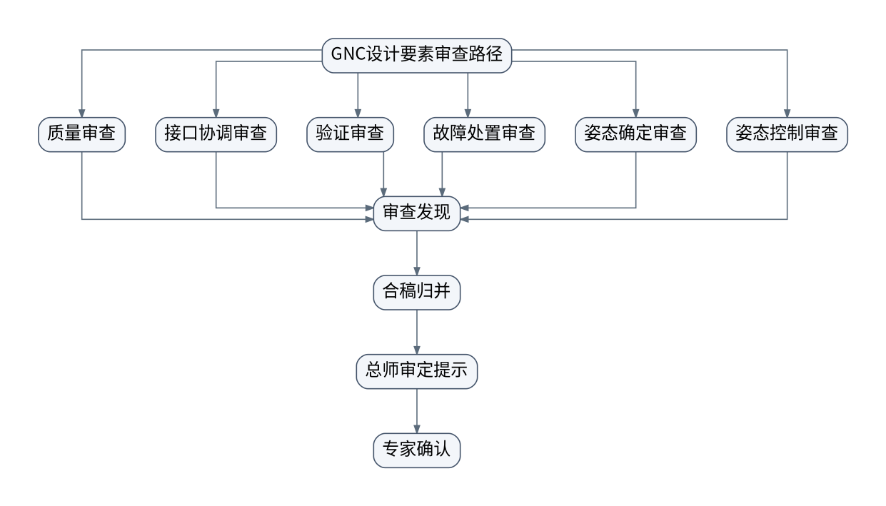

图5-16 GNC设计要素审查执行机制

表5-7 GNC设计要素审查核查重点

| **审查对象** | **核查重点** | **输出** |
| --- | --- | --- |
| 任务要求 | 姿态指向、稳定度、确定精度、机动能力、工作模式是否承接 | 要求响应问题 |
| 方案配置 | 敏感器、执行机构、控制单元、冗余配置是否完整 | 设计缺项问题 |
| 模型算法 | 坐标系、动力学模型、滤波算法、控制律是否说明 | 模型适用性问题 |
| 指标参数 | 名称、数值、单位、工况、容差是否一致 | 参数不一致问题 |
| 验证确认 | 仿真工况、试验条件、验证结果是否闭合 | 验证不足问题 |
| 质量闭环 | 检查单、问题项、整改措施和关闭依据是否完整 | 闭环不完整问题 |

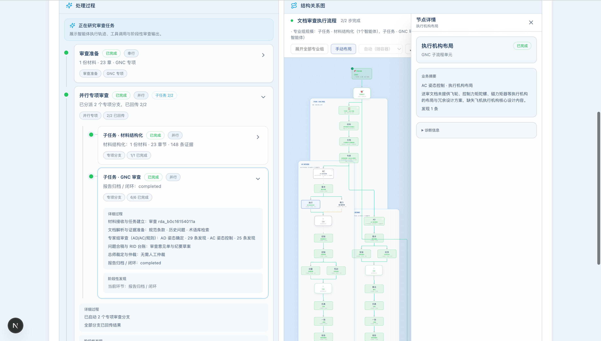

图5-17 GNC设计要素审查执行过程

### **5.7.2 文件组/文文一致性审查处理**

文件组/文文一致性审查面向多份材料之间的相互印证，重点解决任务书、设计报告、接口文件、验证材料、检查单和问题闭环材料之间的要求响应、指标一致、接口一致、验证闭合和整改闭环问题。该路线围绕“要求—设计—验证—闭环”建立跨文档关系并识别差异项。

工程实现可复用文件组十一阶段处理能力，包括材料分类、场景识别、文档解析、文档结构化、审查单元组织、规则抽取、章节映射、条目审查、追溯矩阵、跨文档审查和报告合成。该流程作为实现机制存在，业务表述统一为文件组/文文一致性审查。

图5-18 文件组/文文一致性审查执行机制

表5-8 文件组/文文一致性审查核查重点

| **核查类型** | **处理方式** | **输出** |
| --- | --- | --- |
| 要求响应一致性 | 将任务书要求映射到设计报告章节、参数和说明 | 未响应、部分响应、待确认项 |
| 指标参数一致性 | 比对名称、数值、单位、工况和判据 | 指标差异项 |
| 接口一致性 | 比对接口定义、信号、时序和约束 | 接口疑点 |
| 验证闭合性 | 将指标与仿真、试验、验证结论关联 | 验证不足项 |
| 检查单响应一致性 | 将检查单条款映射到底稿证据 | 已响应、未响应、待确认 |
| 问题闭环一致性 | 关联问题、整改、复查和关闭依据 | 闭环不完整项 |

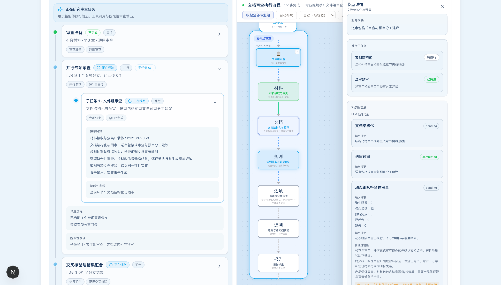

图5-19 文件组/文文一致性审查执行过程

### **5.7.3 智能通用化审查处理**

智能通用化审查面向非标准任务、材料不齐任务、探索性审查任务和尚未配置专用专业规则的场景。系统根据任务目标和材料内容动态生成执行计划，调用通用解析、摘要、抽取、规则核查、问题整理和证据归并能力，形成问题线索、受限结论和后续审查建议。

该路线的结果不等同于GNC专业审查结论。对于材料缺失、规则不足、证据不足的任务，系统应明确输出受限说明和补充材料建议。该路线的价值在于覆盖非标准入口和早期材料整理场景。

图5-20 智能通用化审查执行机制

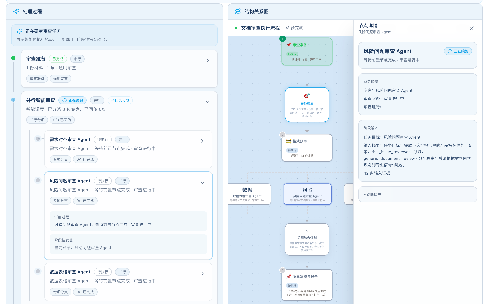

图5-21 智能通用化审查执行过程

## **5.8 审查结果生成与工作台Tab页设计**

审查结果环节承担问题汇聚、证据绑定、结论草稿生成、闭环材料整理和质量结果展示。结果工作台应围绕审查人员使用过程设计Tab页，使材料、底稿、路线、发现、证据、结论和质量状态能够按任务链路查看，并且可以导出为Word、PDF、HTML等报告供其他业务系统作为佐证材料和复核结论。

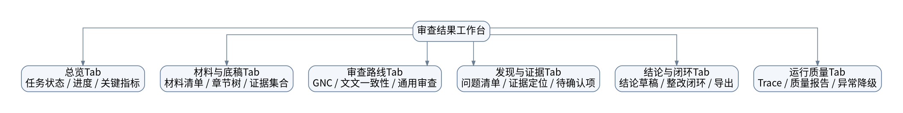

图5-22 审查结果工作台Tab页组织

总览Tab展示任务基础信息、运行状态、当前阶段、材料数量、审查路线、问题数量、待确认事项和质量状态。该页面用于形成任务级态势，帮助审查人员快速判断任务是否完成、是否存在受限条件、是否需要补充材料或人工介入。

材料与底稿Tab展示原始材料清单、材料角色、解析状态、章节结构、表格清单、公式图片清单、证据集合和低可信区域。该页面用于检查材料是否齐套、底稿是否可用、解析是否降级以及哪些内容需要人工复核。

审查路线Tab展示GNC设计要素审查、文件组/文文一致性审查和智能通用化审查的执行状态。每条路线应显示执行节点、审查单元、规则匹配、工具调用和阶段性输出。GNC路线侧重设计要素和专业单元，文文一致性路线侧重追溯矩阵和跨文档差异，通用路线侧重任务规划、问题线索和受限说明。

发现与证据Tab展示审查问题清单、问题类型、严重度建议、涉及材料、证据摘录、页码、章节路径和待确认状态。该页面应支持按问题类型、材料来源、审查路线、确认状态进行筛选，支持从问题跳转到证据位置。

结论与闭环Tab展示审查结论草稿、审查意见单草稿、整改建议、复查要求和关闭状态字段。该页面用于专家复核和后续问题闭环，结论草稿应区分事实整理、问题建议和需专家确认的审查判断。

运行质量Tab展示解析质量、执行质量、证据质量、输出完整性、运行Trace、异常记录和降级路径。该页面用于技术复盘和验收，不参与替代专家审查判断，但为结果可信度和系统稳定性提供依据。

表5-9 审查结果工作台Tab页设计

| **Tab页** | **核心内容** | **服务对象** |
| --- | --- | --- |
| 总览 | 任务信息、阶段状态、审查路线、问题数量、待确认事项 | 审查负责人、业务领导 |
| 材料与底稿 | 材料清单、角色、章节树、证据池、低可信区域 | 审查专家、质量人员 |
| 审查路线 | 三类审查路线执行状态、节点、工具和阶段性输出 | 技术评委、审查专家 |
| 发现与证据 | 问题清单、证据摘录、页码、章节路径、确认状态 | 审查专家 |
| 结论与闭环 | 结论草稿、意见单、整改建议、复查要求、关闭字段 | 评审组织、质量人员 |
| 运行质量 | Trace、QualityReport、异常、降级、耗时和基准结果 | 技术团队、验收人员 |

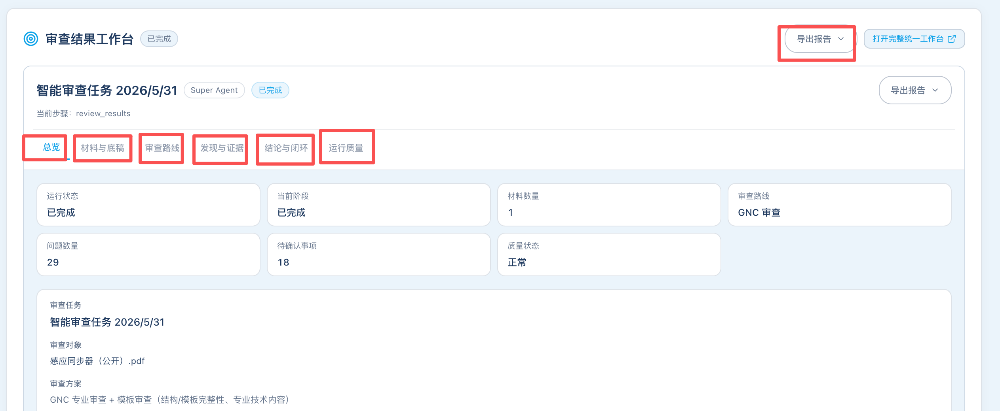

图5-23 审查结果工作台运行质量展示

## **5.9 工具调用与任务编排机制**

工具调用机制贯穿五环节处理链路。数据智能体不依赖单一模型直接生成审查结论，而是将材料接收、材料分类、格式解析、结构化、齐套门控、规则审查、追溯构建、专业审查、合稿和质量评测封装为工具，并由编排层按任务阶段调用。

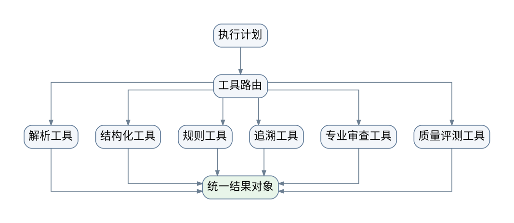

图5-24 工具调用与结果回写机制

表5-10 工具调用与任务编排机制

| **工具类别** | **服务环节** | **主要功能** |
| --- | --- | --- |
| 材料接收工具 | 上传材料 | 保存材料、登记元数据、建立任务上下文 |
| 材料分类工具 | 识别与路由 | 识别材料角色和审查场景 |
| 格式解析工具 | 文档解析 | 解析PDF、Word、Excel、图片、文本等材料 |
| 结构化工具 | 文档解析 | 生成章节树、证据池和结构化材料包 |
| 齐套门控工具 | 文档审查 | 判断材料齐套性、章节缺项和依据缺项 |
| 规则审查工具 | 文档审查 | 执行检查单匹配、参数规则、章节规则 |
| 追溯构建工具 | 文档审查 | 构建要求—设计—验证候选追溯关系 |
| 专业审查工具 | 文档审查 | 执行GNC专业核查和文件组一致性核查 |
| 合稿工具 | 审查结果 | 问题去重、归并、分类和分级 |
| 质量评测工具 | 审查结果 | 生成质量报告、运行Trace和基准指标 |

# **6 验证与效果**

本章围绕数据智能体当前已具备的工程能力开展验证说明。验证不以单一模型问答效果为评价对象，而以“材料能否结构化、审查任务能否编排、证据能否定位、问题能否归并、结果能否复核”为主线。当前实现已集成MinerU用于PDF、扫描件、图表和公式等复杂版面解析，并保留pdftotext等轻量解析作为降级兜底路径。结构化处理结果统一沉淀为文档章节结构、审查依据集合、设计要素候选和运行过程记录。

图6-1 验证场景总体处理流程

表6-1 典型验证场景说明

| **验证场景** | **验证对象** | **核心能力** | **主要输出** |
| --- | --- | --- | --- |
| 场景一：多格式文档解析与结构化底稿验证 | Word、PDF、图片式PDF、含图表/公式/表格材料 | MinerU解析、格式识别、章节结构恢复、图表/公式/表格结构化、证据集合构建 | 结构化审查底稿、章节树、证据集合、表格/公式/图片候选、解析质量记录 |
| 场景二：GNC设计文档审查验证 | GNC设计报告、姿态确定/姿态控制方案、仿真报告 | GNC审查路径、专业审查单元、设计要素提取、问题建议生成 | 设计缺项、参数问题、验证不足、专家确认项、审查意见单草稿 |
| 场景三：文件组文文一致性审查验证 | 任务书、设计方案、接口文件、检查单、仿真验证材料 | 材料角色识别、文件组门控、需求—设计—验证追溯、跨文档一致性核查 | 追溯矩阵、指标不一致清单、检查单响应状态、跨文档问题建议 |
| 场景四：通用化智能审查验证 | 非GNC专项材料、通用工程文档、临时审查任务 | Super Agent统一入口、任务分类、通用审查规划、工具组合调用 | 结构化摘要、问题清单、风险提示、待确认项、通用审查报告草稿 |
| 场景五：质量产保自查与历史问题闭环验证 | 质量产保自查表、评审问题清单、整改记录、历史问题材料 | 问题归并、闭环状态识别、历史问题复用、整改证据关联 | 问题闭环表、历史问题复现提示、整改缺项、关闭依据清单 |

## **6.1 场景一、二：多格式文档解析与结构化底稿验证**

验证数据智能体对送审材料的基础处理能力。该场景覆盖Word等半结构化文档中的图表解析、常规PDF解析、图片式PDF/扫描PDF解析，以及含表格、公式、图片、图注和参数条目的复杂工程材料解析。验证重点不是单纯抽取文本，而是形成可供后续审查调用的结构化底稿。

输入材料如下：

表6-2 多格式文档解析验证输入材料

| **材料类型** | **典型内容** | **验证重点** |
| --- | --- | --- |
| Word/半结构化文档 | 设计方案、检查单、质量自查表、含表格和嵌入图片的说明材料 | 标题层级、表格单元格、图片说明、参数条目保持结构 |
| 常规PDF | 设计报告、仿真报告、接口说明 | 正文、章节、页码、表格、公式和证据片段定位 |
| 图片式PDF/扫描PDF | 扫描版评审材料、老旧资料、图片化报告 | 版面区域识别、OCR文本提取、解析质量标记 |
| 图表/公式密集材料 | 参数表、仿真曲线、控制律公式、矩阵表达式 | 表格结构化、公式候选识别、图表与章节关联 |

数据智能体经Super Agent统一入口接收材料后，先完成文件入库和格式识别，再调用MinerU解析通道进行版面分析、文本识别、表格结构化、图片区域识别和公式候选抽取；对无法稳定解析的材料，自动记录解析异常并按pdftotext等降级路径提取可用文本。解析结果经结构化处理形成文档章节结构、审查依据集合和材料处理日志。

表6-3 多格式文档解析验证输出

| **输出项** | **说明** |
| --- | --- |
| 结构化审查底稿 | 按材料、章节、段落、表格、公式、图片和证据片段组织，可作为后续审查输入 |
| 文档章节结构 | 保留标题层级、章节路径、页码或位置关系，支撑章节缺项检查和证据定位 |
| 审查依据集合 | 提取可被问题项引用的原文片段、表格行列、公式候选和图表说明 |
| 图表/公式/参数候选 | 对设计参数表、公式表达、图片和图注形成候选结构化对象 |
| 解析质量记录 | 记录MinerU解析结果、降级解析情况、低置信区域和人工复核提示 |

该场景验证数据智能体已经具备以MinerU为主通道的多格式材料解析能力，能够将常规PDF、Word半结构化材料、图片式PDF和图表公式密集材料转换为结构化审查底稿。复杂嵌套表格、低质量扫描件、工程曲线图语义解释和公式推导正确性仍应进入人工复核或专业增强处理。

图6-2 多格式材料解析进度与结构化预览

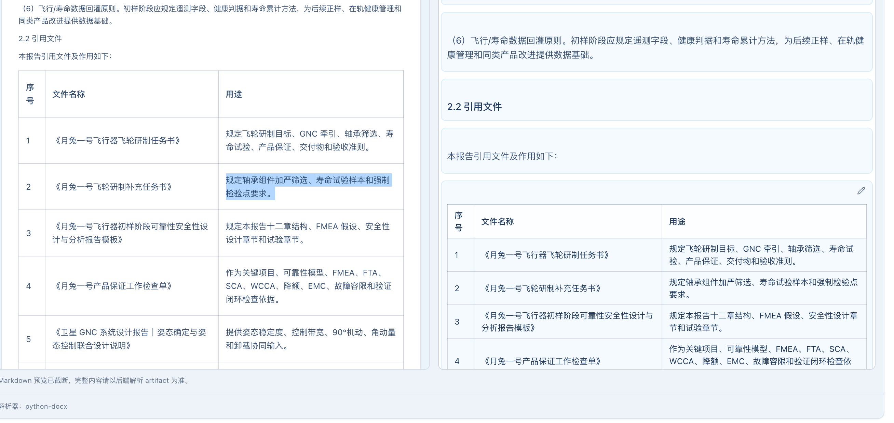

图6-3 Word半结构化文档解析效果

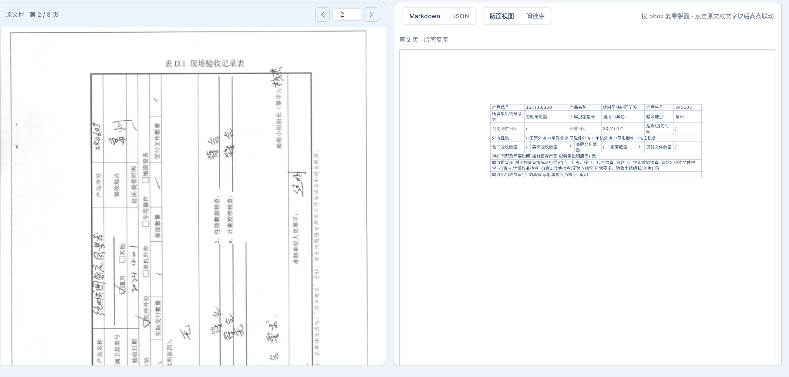

图6-4 扫描件方向归一化与表单结构化效果

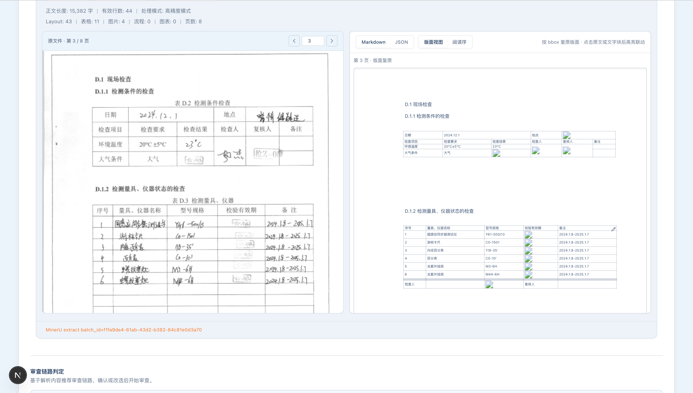

图6-5 扫描检查表结构化识别效果

## **6.2 场景三：GNC设计文档审查验证**

验证数据智能体对GNC设计报告和专业方案材料的审查能力，重点检查姿态确定、姿态控制、FDIR、接口、验证充分性等设计要素是否完整，审查发现能否绑定证据并形成专家可复核的问题建议。

表6-4 GNC设计文档审查验证输入

| **输入项** | **示例** |
| --- | --- |
| 产品型号 | XX卫星或某型号GNC分系统 |
| 评审阶段 | 方案设计评审、初样设计评审、CDR前复查等 |
| 评审范围 | ad\_ac，即姿态确定设计与姿态控制设计；可扩展至接口、FDIR和验证充分性 |
| 文档材料 | 任务需求输入文件、GNC设计报告、设计仿真报告、接口说明、专业检查单 |

在结构化底稿形成后，Super Agent将任务路由至GNC设计要素审查路径。数据智能体根据文档章节结构提取姿态确定、姿态控制、执行机构配置、控制律、参数表、仿真工况和故障处置相关条目；再按GNC审查流程组织专业核查，形成设计缺项、指标不一致、参数来源不清、验证覆盖不足等问题建议。

表6-5 GNC设计文档审查验证输出

| **输出类别** | **输出内容** |
| --- | --- |
| 材料质量结论 | 章节完整性、材料可审查性、解析异常和缺项提示 |
| 设计要素清单 | 姿态确定、姿态控制、执行机构、传感器、控制律、参数、验证项等候选对象 |
| 专业审查发现 | 重大问题、主要问题、一般问题、建议项和待专家确认项 |
| 证据定位 | 问题对应的来源文档、章节路径、页码、表格或原文摘录 |
| 结论草稿 | 审查意见单草稿、纪要草稿和需总师审定事项 |

示例问题可表述为：某章节提出推力器布局设计，但未说明单轴推力器失效条件下的三轴姿控能力保持情况；相关仿真材料未给出对应故障工况验证。该类发现应绑定设计报告章节、接口约束、仿真工况清单和检查单条款，由专家确认其严重度和整改要求。

该场景验证数据智能体能够将GNC设计文档审查从“人工通读材料”转化为“结构化底稿复核、问题建议确认、关键判断审定”。数据智能体能够辅助形成专业审查发现，但对控制方案优劣、风险接受和型号放行结论不作自动裁决。

具体任务的审查流程如下：
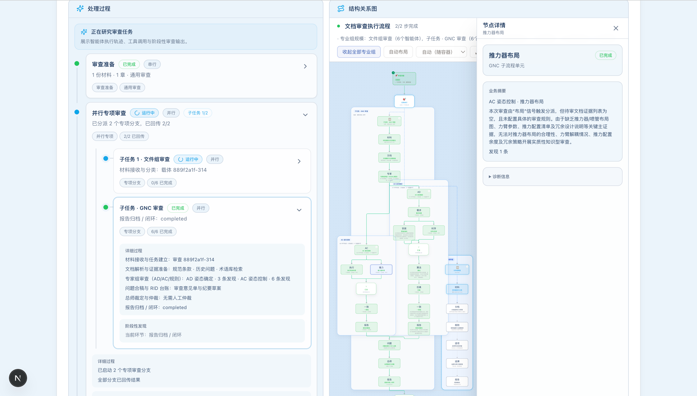

图6-6 GNC设计文档审查流程界面

审查过程展示工作流及动态Agent调用情况，如图所示。

审查结果展示严重问题、不合格项、不一致项、证据不足项等内容。

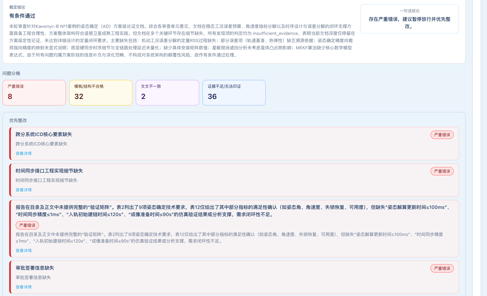

图6-7 GNC设计文档审查结果总览

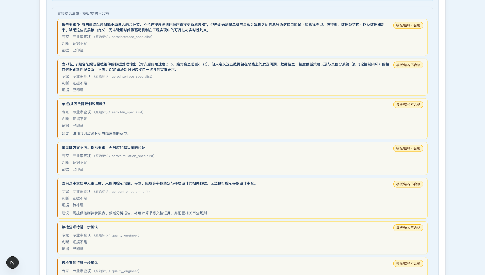

图6-8 GNC设计文档审查问题清单

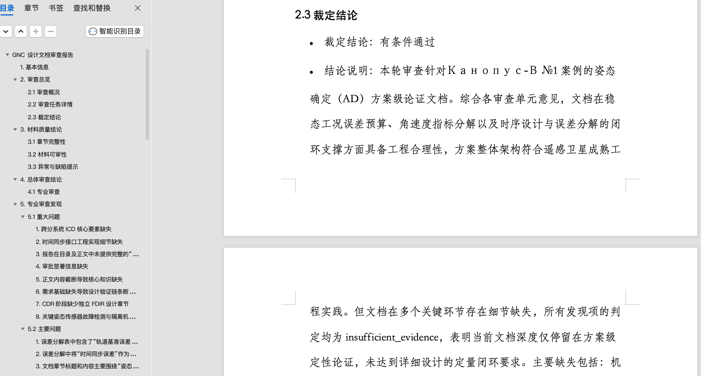

图6-9 GNC设计文档审查问题详情

## **6.3 场景四：文件组文文一致性审查验证**

验证任务书、设计方案、接口控制文件、仿真验证报告、技术方案检查单等文件组之间的一致性审查能力。该场景重点回答任务要求是否被设计承接、设计指标是否被验证支撑、检查单条款是否有对应依据、接口参数是否前后一致。

表6-6 文件组文文一致性审查材料角色

| **材料角色** | **审查作用** |
| --- | --- |
| 任务书/研制要求 | 作为需求源头，提供任务指标、可靠性要求、安全要求和验证约束 |
| GNC设计方案/设计报告 | 作为被审对象，说明方案配置、算法模型、参数取值和接口设计 |
| 接口控制文件 | 用于核查信号定义、时序、数据刷新率、总线约束和接口一致性 |
| 仿真验证报告/试验报告 | 用于核查设计指标、边界工况、故障工况和组合工况覆盖情况 |
| 技术方案检查单 | 用于核查条款响应、证据充分性和审查准入条件 |

数据智能体先进行材料角色识别和文件组齐套性判定，再以结构化底稿为基础构建需求—设计—验证候选追溯矩阵。对显式编号、指标名称、单位、工况、接口参数和检查单条款进行跨文档比对，形成一致、部分一致、不一致、缺少依据和待确认等状态。

表6-7 文件组文文一致性审查输出

| **输出项** | **说明** |
| --- | --- |
| 文件组齐套性结果 | 判断任务书、设计报告、检查单、接口文件、验证材料是否满足审查准入 |
| 需求—设计—验证追溯矩阵 | 建立任务要求、设计响应、验证条目之间的候选关联 |
| 指标一致性清单 | 发现指标名称、数值、单位、工况或版本基线不一致问题 |
| 检查单响应状态表 | 形成已响应、部分响应、未响应和待专家确认状态 |
| 跨文档问题建议 | 识别设计报告与ICD、仿真报告与设计参数、检查单与证据之间的不一致 |

该场景验证数据智能体能够对多份并行演进的型号材料进行结构化比对，减少人工交叉翻阅和遗漏。对指标口径差异、版本基线差异和隐含工程耦合关系，数据智能体提供证据定位和待确认提示，由专家作最终判断。

具体实现如下：
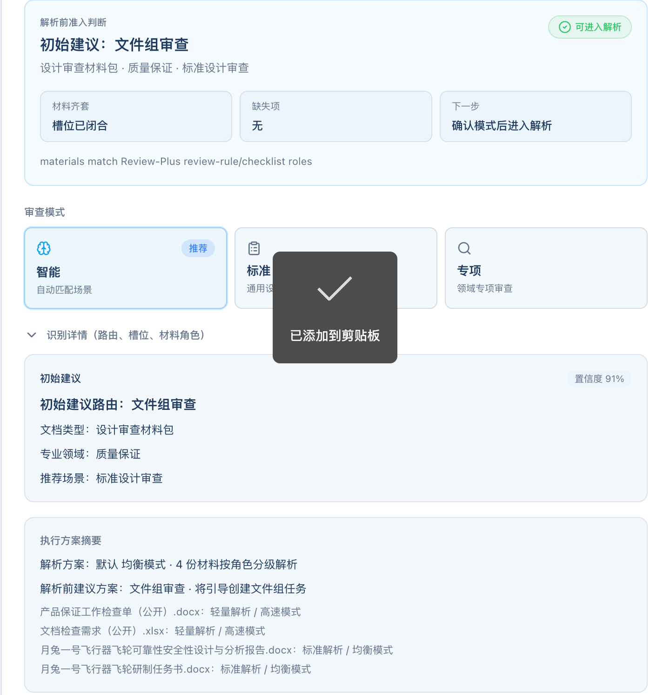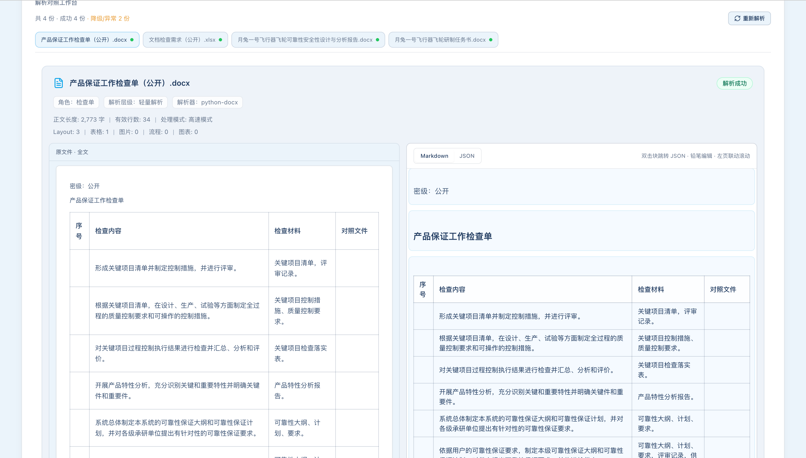

图6-10 文件组文文一致性审查初始化界面

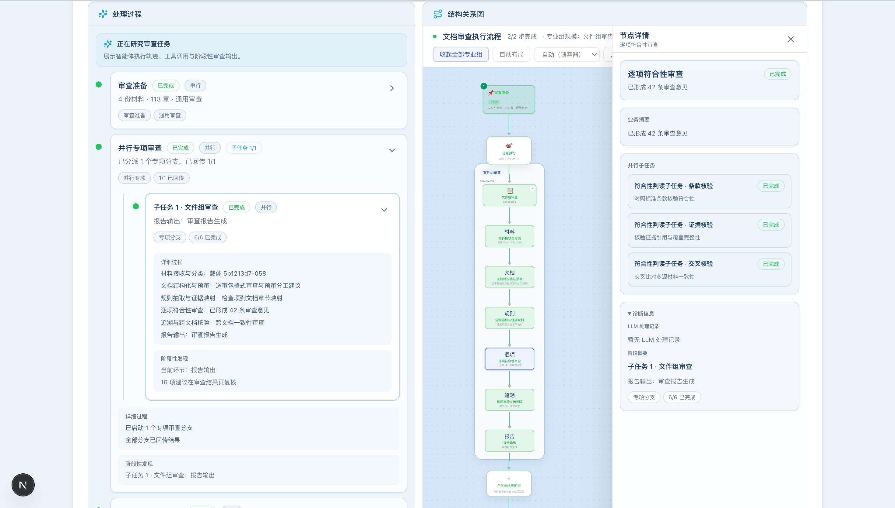

图6-11 文件组材料解析与底稿生成界面

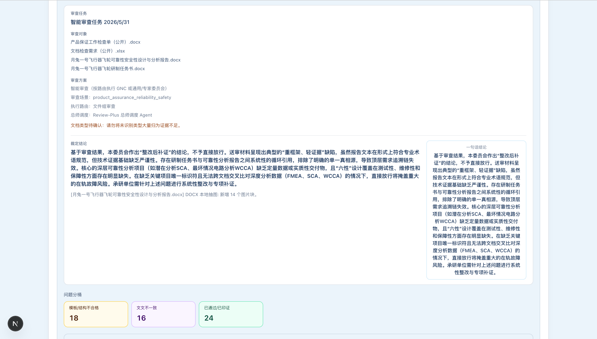

图6-12 文件组文文一致性审查流程界面

图6-13 文件组文文一致性审查结果界面

## **6.4 场景五：通用化智能审查验证**

验证数据智能体在非固定GNC专项流程下的通用审查能力。该能力用于处理临时性、探索性或尚未配置完整专业规则的工程文档审查任务，重点验证Super Agent统一入口的分类、规划、工具组合和通用问题整理能力。

表6-8 通用化智能审查任务类型

| **任务类型** | **审查重点** |
| --- | --- |
| 单文档审阅 | 文档结构、关键指标、风险点、缺项和证据摘要 |
| 材料包初筛 | 材料角色、齐套性、解析质量、是否具备深度审查条件 |
| 非GNC工程材料 | 按通用工程文档规则形成问题清单和待确认项 |
| 临时专项问题 | 根据用户提出的目标组合调用解析、检索、规则匹配和报告生成工具 |

Super Agent接收任务后，先完成材料结构化和场景识别。对于不满足GNC专用流程或文文一致性审查条件的任务，系统进入通用智能审查路径，基于任务目标生成执行计划，调用结构化、摘要、规则匹配、证据定位、问题归并和报告生成等工具，形成通用化审查结果。

表6-9 通用化智能审查输出

| **输出项** | **说明** |
| --- | --- |
| 结构化摘要 | 按材料和章节形成可阅读摘要 |
| 问题清单 | 识别材料缺项、逻辑不完整、参数缺失、证据不足等通用问题 |
| 风险提示 | 标记需要人工进一步研判的内容 |
| 审查计划和执行记录 | 记录工具调用步骤、异常、降级和输出结果 |
| 报告草稿 | 形成可供专家继续修改的通用审查报告 |

通用化智能审查验证了数据智能体的可扩展性。该路径不替代GNC专业审查路径，也不输出型号专业结论；其价值在于对未知任务、非标准材料和早期材料包进行快速结构化、问题整理和审查准备。

图6-15 通用化智能审查流程界面

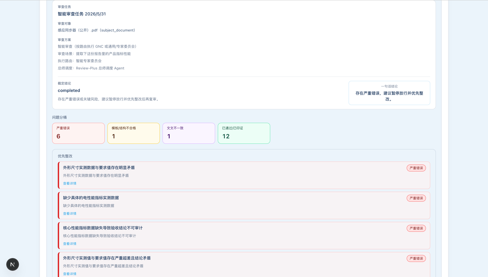

图6-16 通用化智能审查结果界面

## **6.5 综合验证结论**

五类场景覆盖了数据智能体从材料解析、专业审查、文件组一致性、通用化任务到质量闭环的主要能力边界。验证结果表明，数据智能体已具备以MinerU解析为基础的复杂文档结构化能力，并能够在结构化底稿上组织GNC审查、文文一致性审查和通用智能审查。当前能力重点适用于评审前辅助审查、设计报告复查、材料齐套性预检、检查单响应核查和质量问题闭环整理；正式审查结论仍须由专家复核后形成。

表6-10 综合验证结论与深化方向

| **能力维度** | **当前验证结论** | **后续深化方向** |
| --- | --- | --- |
| 材料解析 | MinerU已作为复杂文档解析主通道，pdftotext等作为降级兜底 | 提升低质量扫描件、复杂表格、公式语义和工程图表理解能力 |
| GNC审查 | 可形成设计要素候选、问题建议和证据定位 | 完善专业规则库、单元级深审和总师审定策略 |
| 文文一致性 | 可支持任务书、设计报告、检查单、接口和验证材料的追溯候选构建 | 增强隐含逻辑关系和版本基线差异判断 |
| 通用智能审查 | 可对非标准任务进行结构化、初筛和报告草稿生成 | 扩展更多专业领域装配和任务模板 |

后续建设应重点完善五类能力：一是进一步强化MinerU精准解析与人工复核闭环，提高图片式PDF、复杂表格、公式和图注的可用性；二是完善GNC专业规则库和历史问题库，将专家经验转化为可重复执行的审查规则；三是增强文文一致性审查，提升任务书、方案、接口、仿真和检查单之间的追溯覆盖；四是完善质量评测和基准回归，形成可量化、可复现的验收依据；五是对接型号数据中心、知识库、流程系统和质量管理系统，形成可持续运行的审查能力平台。

# **7 应用前景**

面向GNC设计要素审查的数据智能体具备沿研制流程纵向深化、向其他控制专业横向推广、向型号审查知识资产沉淀演进的应用基础。其核心价值不局限于单次评审提效，而在于将材料结构化、审查规则、历史问题、证据链和专家确认过程沉淀为可复用能力。

## **7.1 全生命周期AI审查能力深化**

在需求分析阶段，数据智能体可围绕需求文档中的性能、可靠性、安全性和接口指标，建立需求到设计要素的映射关系，辅助识别需求分解不完整、指标口径不一致和需求可实现性不足等问题。在方案设计阶段，可继续深化当前GNC审查能力，对设计输入、方案配置、控制指标、参数表、仿真验证和质量检查单进行关联审查，支撑方案完整性、一致性和可验证性判断。

在软件开发阶段，可将需求和设计要素映射到软件架构、接口定义和代码实现，通过静态分析、接口检查和规范审查识别功能遗漏、过度设计、时序不一致和资源占用异常等问题。在集成测试阶段，可构建设计指标与测试用例之间的映射关系，识别关键设计要素是否被充分验证，并结合实测数据分析设计预期与测试结果之间的偏差。在在轨服务阶段，可进一步将遥测数据与设计基线关联，对性能偏离、冗余设计有效性和容错机制实际效果进行分析，为后续型号迭代提供依据。

## **7.2 向其他控制专业推广**

卫星GNC、导弹制导控制、运载火箭姿控与导航控制等领域均具有复杂控制理论、高可靠性设计、多文档协同和严格评审闭环等共性。数据智能体在GNC领域形成的材料解析、结构化底稿、审查流程编排、追溯矩阵、专业规则库和问题闭环机制，可经领域适配后迁移至其他控制专业。

推广时应保持通用底座稳定复用，重点替换领域术语、审查规则、检查单条款、专业知识库、历史问题库和输出模板。可直接迁移的能力包括需求解析与验证、架构设计审查、接口一致性核查、验证充分性检查、质量问题闭环和审查证据链组织。需要补充建设的内容包括导弹、火箭等领域专用指标体系、典型失效模式、控制律审查规则、飞行剖面约束和专业验证工况库。

## **7.3 向型号审查知识资产演进**

数据智能体应从单次辅助审查工具逐步演进为型号审查知识工程底座。第一阶段形成结构化材料底稿库，沉淀任务书、设计报告、接口文件、仿真报告和检查单的章节结构、参数表、公式候选和证据集合。第二阶段形成专业规则库，将检查单条款、模板要求、典型问题、参数单位和验证覆盖规则结构化。第三阶段形成历史问题复用库，将评审发现、整改措施、复查结论和关闭依据按型号、阶段、专业和问题类型归档。第四阶段形成跨型号审查知识资产，支撑跨型号问题复用、质量趋势分析和专家经验传承。

# **8 人工复核要求**

数据智能体可自动完成材料接收、格式识别、文档结构化、材料齐套性检查、章节缺项提示、检查单候选匹配、设计要素候选提取、显式跨材料一致性提示、问题建议生成、意见单草稿和过程留痕。

以下内容必须人工确认：材料角色歧义、关键参数抽取、指标不一致原因、检查单部分响应、隐含追溯关系、重大问题严重度、整改建议、正式审查结论、风险接受和放行建议。系统输出属于智能辅助审查结果，不能替代专家审查责任、质量确认责任和型号决策责任。

# **9 结论**

面向GNC设计要素审查的数据智能体已形成以Super Agent为统一入口、以GNC设计审查、文文一致性审查和通用智能审查为三类能力路径、以结构化底稿、追溯矩阵、动态专家组队和质量评测为共用支撑机制的技术方案。该方案将多格式材料解析、任务规划、工具调用、专业核查、证据追溯、问题合稿和过程留痕统一到可运行链路中，能够支撑评审前辅助审查、设计报告复查、检查单执行、质量产保自查和问题闭环管理。

后续应重点完善复杂扫描件和工程图解析、模板章节深度门控、关键参数和公式校核、质量闭环状态表、GNC专业规则库、历史问题库、真实型号基准样例和生产级压测机制，逐步由单场景辅助审查工具演进为型号审查知识工程底座。