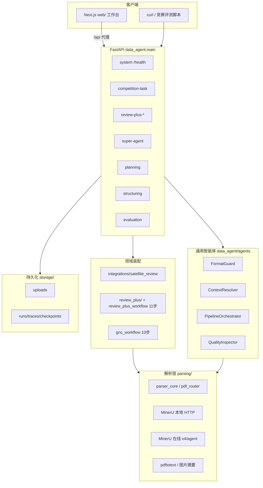

# 面向航天器 GNC 分系统设计要素智能审查的数据智能体 — 部署与运行说明

> 本文面向评审与运维人员，说明面向航天器 GNC 分系统设计要素智能审查的数据智能体（基于 Data Agent 架构）的部署与运行。完整源代码不在 `提交材料/` 内，请使用仓库根目录。

## 0. 部署边界（本地验收）

本系统按**本地部署验收**设计：评审机在 clone 仓库后于本机启动 API（§3），无需公网演示地址。

| 情况 | 说明 |
| --- | --- |
| **无公网服务** | 正常。按 §3.1 安装依赖、`cp .env.example .env`、启动 `uvicorn … --port 8080` 即可验收 |
| **可选前端** | §3.2 工作台，非竞赛 API 必需 |
| **LLM / MinerU** | 可选；未配置时解析与审查分步降级（§7） |

竞赛三端点 curl 与参数表见 **[API接口说明.md](./API接口说明.md)**；OpenAPI 分组见启动后 `/docs` 或 `/openapi.json`。

## 1. 系统架构



**能力分层**（与 README 一致）：

- `data_agent/agents/`：格式自愈、指代消解、DAG 编排、五维评测（通用）
- `data_agent/integrations/`：领域规划与 ToolHandler（当前：卫星/GNC 审查）
- `data_agent/parsing/`：多格式解析与 MinerU 降级链
- `data_agent/review_plus/` + `workflows/review_plus_workflow.py`：**11 步**审查链路
- `integrations/satellite_review/gnc_workflow.py`：**10 步** GNC 设计审查（独立领域流）

## 2. 运行环境

### 2.1 操作系统

- 推荐：**Linux**（Ubuntu 22.04+）或 **WSL2**（本仓库开发环境）
- 亦可在 macOS 上运行；Windows 建议 WSL2

### 2.2 软件依赖

| 组件 | 版本要求 | 说明 |
| --- | --- | --- |
| Python | ≥ 3.10 | `pyproject.toml` |
| uv（推荐）或 pip | 任意现代版本 | `uv sync --extra dev` 或 `pip install -e ".[dev]"` |
| poppler-utils | 可选 | 提供 `pdftotext`，PDF 兜底解析 |
| Node.js + bun | 可选 | 仅前端 `web/` 需要 |

### 2.3 Python 主要依赖

见 `pyproject.toml`：FastAPI、uvicorn、agno、pydantic、python-docx、openpyxl、httpx、openai 等。

### 2.4 硬件资源建议

| 场景 | CPU | 内存 | 磁盘 | GPU |
| --- | --- | --- | --- | --- |
| API + 本地 fixture 测试 | 2 核+ | 4 GB+ | 2 GB+ | 不需要 |
| Review-Plus + LLM Agent | 4 核+ | 8 GB+ | 10 GB+（材料与 trace） | 不需要 |
| MinerU 本地 `hybrid-auto-engine` | 8 核+ | 16 GB+ | 视模型而定 | **建议**（MinerU 服务侧） |

### 2.5 环境变量

复制仓库根目录 `.env.example` 为 `.env`。核心项：

| 变量 | 作用 |
| --- | --- |
| `API_TOKEN` | REST 认证（默认 `dev-token-change-me`；**公网必须改掉**） |
| `API_EXPOSE_SCOPE` | `full` \| `competition` \| `demo` — 公网建议 `competition` |
| `INTERNAL_API_TOKEN` | 内网旁路头 `X-Internal-Request` / `X-Internal-Token`（可选） |
| `LLM_*` / `VLM_*` | 文本/视觉模型（审查与增强） |
| `MINERU_LOCAL_*` | 本地 MinerU HTTP（`POST /file_parse`） |
| `MINERU_AGENT_API_TOKEN` | MinerU 在线 v4 extract |
| `REVIEW_PLUS_AGENTS_ENABLED` | 启用 Review-Plus LLM Agent 步骤 |

#### 评审机最小 `.env`（摘自根目录 `.env.example`）

无 LLM/MinerU 时仍可跑健康检查、离线基准与多数解析测试：

```bash
# 评审机最小配置 — 复制为仓库根 .env 后按需增补 LLM / MinerU
API_TOKEN=dev-token-change-me

# 关闭本地 MinerU，避免评审机无服务时阻塞（与评审机离线 pytest / 基准一致）
MINERU_LOCAL_ENABLED=0
MINERU_AGENT_API_ENABLED=0
MINERU_EXTRACT_API_ENABLED=0

# Review-Plus LLM Agent 步骤默认关闭；结构化/规则步骤仍可跑
# REVIEW_PLUS_AGENTS_ENABLED=0

# 日志（可选）
# LOG_LEVEL=INFO
```

需要 PDF 高精度或完整审查 Agent 时，再取消注释并填写 `LLM_API_KEY`、`MINERU_*` 等（见根 `.env.example` 全文）。

## 3. 启动方式

评审验收采用**本地代码部署**：在仓库根目录安装依赖、配置 `.env`、用 uvicorn 启动 API。

### 3.1 后端 API（评审推荐）

```bash
cd /path/to/data-agent

# 1) 安装依赖（推荐 uv，与 pyproject.toml / uv.lock 一致）
uv sync --extra dev
# 或：pip install -e ".[dev]"

# 2) 配置环境变量
cp .env.example .env
# 编辑 .env：至少设置 API_TOKEN；按需配置 LLM / MinerU（评审机最小配置见 §2.5）

# 3) 启动 API（评审与 curl 示例统一端口 8080）
uv run uvicorn data_agent.main:app --host 0.0.0.0 --port 8080
# 或：uvicorn data_agent.main:app --host 0.0.0.0 --port 8080
```

**端口说明**：

| 启动方式 | 默认端口 | 用途 |
| --- | --- | --- |
| 评审文档 / 竞赛 curl | **8080** | 本文与 [API接口说明.md](./API接口说明.md) 示例均使用此端口 |
| `./scripts/prod.sh` | 8080 | 生产模式一键启停（后端 + 前端 standalone） |
| `./scripts/dev.sh` | 8081 | 本地开发（后端热重载 + 前端 dev server） |
| `python -m data_agent.main` | 8088 | 模块入口默认，评审时请显式 `--port 8080` |

验证：

```bash
curl -s http://127.0.0.1:8080/health
# Swagger: http://127.0.0.1:8080/docs
```

**一键脚本（可选）**：

```bash
# 仅后端 + 前端，评审 API 仍建议 §3.1 直接 uvicorn --port 8080
./scripts/prod.sh          # 后端 8080 + 前端 3000
./scripts/prod.sh -k       # 停止

./scripts/dev.sh           # 开发：后端 8081 + 前端 3000
./scripts/dev.sh -k        # 停止
```

### 3.2 前端工作台（可选）

竞赛三端点 API 验收**不依赖**前端；以下为交互式 Review-Plus 工作台。

```bash
cd web
cp .env.example .env.local
bun install
bun run dev
# 默认 http://127.0.0.1:3000/review-plus-v2
# API 代理：DATA_AGENT_API_ORIGIN=http://127.0.0.1:8080
```

## 4. 测试方法

测试任务文件、运行日志字段与可追溯性说明见 **[测试与日志说明.md](./测试与日志说明.md)**。

### 4.1 单元与集成测试（可选）

`pyproject.toml` 配置了 `testpaths = ["tests"]`。**当前 clone 可能不含 `tests/` 目录**；若无该目录，请跳过 pytest，以 §4.2 离线基准与 §4.4 API 冒烟为主（见 [测试与日志说明.md](./测试与日志说明.md) §7）。

完整工程检出后：

```bash
uv run pytest -q --tb=no
# 或：pytest -q --tb=no
```

离线 pytest 通常会在进程内关闭 MinerU 本地与在线 API（与评审机最小 `.env` 一致），保证无外部依赖可跑。

#### 已知问题与推荐子集

全量 `pytest -q` 在部分环境可能出现较多 **401**（HTTP 测试未统一注入 `API_TOKEN`）。历史摘要见 [测试结果/单元测试摘要.txt](./测试结果/单元测试摘要.txt)（**索引文件**，当前 clone 可能为空，需本地实跑生成）。

**推荐子集**（完整 `tests/` 检出时，核心离线路径，不依赖 LLM/MinerU）：

```bash
uv run pytest -q tests/test_golden_benchmark.py tests/test_pdf_auto_parse_chain.py \
  tests/test_review_plus_workflow.py tests/test_gnc_workflow.py --tb=no
```

带 Token 的 API 冒烟见 §4.4；竞赛任务接口见 [API接口说明.md](./API接口说明.md)。

### 4.2 离线基准评测（推荐验收）

```bash
uv run python benchmark/run_golden.py --fail-on-gate
# 或：python3 benchmark/run_golden.py --fail-on-gate

# 导出 JSON / Markdown 报告（可选）
uv run python benchmark/run_golden.py \
  --json-out 提交材料/测试结果/基准运行摘要.json \
  --markdown-out 提交材料/测试结果/基准摘要.md
```

门禁见 `benchmark/golden_manifest.json`（`structure_tree_f1`、`p95_elapsed_ms` 等）。`提交材料/测试结果/` 为索引目录，**首次实跑前可能为空**。

### 4.3 PDF / 文档包专项

```bash
uv run python benchmark/benchmark_pdf.py
uv run python benchmark/benchmark_doc_package.py
```

### 4.4 API 冒烟

```bash
export TOKEN=dev-token-change-me
curl -H "Authorization: Bearer $TOKEN" http://127.0.0.1:8080/api/v1/structuring/modes
curl -H "Authorization: Bearer $TOKEN" http://127.0.0.1:8080/api/v1/super-agent/capabilities
```

竞赛三端点完整示例见 [API接口说明.md](./API接口说明.md)。

### 4.5 提交包 测试数据 与 ywdata 示例

**测试数据 来源**（按优先级）：

| 方式 | 命令 | 说明 |
| --- | --- | --- |
| **评审材料（提交包内）** | `bash 提交材料/示例/脚本/复制业务数据.sh` | 无 `ywdata/` 时自动使用 [评审材料/月兔一号](./评审材料/月兔一号/) 真实材料 |
| 真实 ywdata | 同上（需仓库根 `ywdata/doc/q1`） | 有 ywdata 时优先于 评审材料 |
| 脱敏最小样例 | `python3 提交材料/示例/脚本/生成最小测试数据.py` | 无 评审材料/ywdata 时的离线冒烟 fallback |

任务三离线门禁仍使用 `tests/fixtures/review_docs/*.md`；**任务一实跑**使用示例 **01–03** 的 `测试数据/`。映射：[示例/业务数据映射表.md](./示例/业务数据映射表.md)。

```bash
# 任务一：多格式 structuring（示例 01）
FIX="$(pwd)/提交材料/示例/01-多格式结构化/测试数据"
curl -s -X POST http://127.0.0.1:8080/api/v1/structuring/parse \
  -H "Authorization: Bearer dev-token-change-me" \
  -H "Content-Type: application/json" \
  -d "{\"file_path\":\"$FIX/月兔一号_飞轮研制任务书.docx\",\"file_name\":\"task_book.docx\",\"parser_type\":\"auto\"}"

# 任务二：竞赛 API 四文件包（示例 04，JSON + path，见 API接口说明.md）
FIX="$(pwd)/提交材料/示例/04-规划与编排/测试数据"
curl -s -X POST http://127.0.0.1:8080/api/v1/task/submit \
  -H "Authorization: Bearer dev-token-change-me" \
  -H "Content-Type: application/json" \
  -d "{\"task_description\":\"飞轮文档包\",\"documents\":[
    {\"file_name\":\"月兔一号_产品保证检查单.docx\",\"content_type\":\"path\",\"content\":\"$FIX/月兔一号_产品保证检查单.docx\"},
    {\"file_name\":\"月兔一号_飞轮研制任务书.docx\",\"content_type\":\"path\",\"content\":\"$FIX/月兔一号_飞轮研制任务书.docx\"},
    {\"file_name\":\"月兔一号_飞轮设计分析报告.docx\",\"content_type\":\"path\",\"content\":\"$FIX/月兔一号_飞轮设计分析报告.docx\"},
    {\"file_name\":\"月兔一号_文档检查需求.xlsx\",\"content_type\":\"path\",\"content\":\"$FIX/月兔一号_文档检查需求.xlsx\"}
  ]}"

# 任务一：PDF（示例 02）
PDF="$(pwd)/提交材料/示例/02-PDF验收解析/测试数据/CMG50_验收报告.pdf"
curl -s -X POST http://127.0.0.1:8080/api/v1/structuring/parse \
  -H "Authorization: Bearer dev-token-change-me" \
  -H "Content-Type: application/json" \
  -d "{\"file_path\":\"$PDF\",\"file_name\":\"CMG50_验收报告.pdf\",\"processing_mode\":\"OPTIMAL\",\"parser_type\":\"auto\"}"

# 任务一：跨文档（示例 03）
DIR="$(pwd)/提交材料/示例/03-跨文档指代/测试数据"
RUN=$(curl -s -X POST http://127.0.0.1:8080/api/v1/super-agent/runs \
  -H "Authorization: Bearer dev-token-change-me" -H "Content-Type: application/json" \
  -d '{"name":"任务一-跨文档","objective":"任务书与设计报告追溯","requested_route":"structure","processing_mode":"OPTIMAL","execute":false}' \
  | python3 -c "import sys,json; print(json.load(sys.stdin)['data']['run_id'])")
curl -s -X POST "http://127.0.0.1:8080/api/v1/super-agent/runs/$RUN/execute" \
  -H "Authorization: Bearer dev-token-change-me" \
  -F "files=@$DIR/月兔一号_飞轮研制任务书.docx" \
  -F "files=@$DIR/月兔一号_飞轮设计分析报告.docx" \
  -F "parser_type=auto"
```

## 5. 日志查看

字段与评审追溯映射见 **[测试与日志说明.md](./测试与日志说明.md)** §2、§4。

| 类型 | 位置 / 方式 |
| --- | --- |
| 应用 stdout | uvicorn 控制台；级别 `LOG_LEVEL`（默认 INFO） |
| Agno Agent | `AGNO_LOG_PATH`（默认 `.dev/logs/agno.log`） |
| 调试埋点 | `AGENT_DEBUG_LOG_PATH` |
| 规划 Trace | `GET /api/v1/planning/trace/{plan_id}` |
| Super Agent Run | `storage/runs/review_data_agent_runs/*.json` |
| Review-Plus 事件 | `GET /api/v1/review-plus/reviews/{id}/events` |
| Review-Plus Agent | `GET /api/v1/review-plus/reviews/{id}/agent-traces` |
| 解析降级 | 响应/artifact 内 `parser_fallback_logs` |

## 6. API 与认证

- **竞赛任务 API（curl / 参数 / 错误码）**：[API接口说明.md](./API接口说明.md)
- **OpenAPI 分组**：`http://127.0.0.1:8080/docs`（本包未附独立 `/docs 或 /openapi.json` 时以运行实例为准）
- **在线文档**：`/docs`、`/redoc`、`/openapi.json`
- **认证**（除 `GET /health`）：
  - `Authorization: Bearer {API_TOKEN}`
  - 或 `X-API-Key: {API_TOKEN}`
- **竞赛三端点**：`POST /api/v1/task/submit`、`GET /api/v1/task/status/{task_id}`、`GET /api/v1/task/result/{task_id}`
- **Review-Plus**：前缀 `/api/v1/review-plus/reviews`，11 步工作流由 `POST .../start` 触发

## 7. MinerU 与 LLM 限制

1. **MinerU 本地**：需在本机或内网独立部署 MinerU HTTP 服务；未启动时 `GET /health` 返回 `degraded`，解析走在线或 pdftotext。
2. **MinerU 在线 v4**：需有效 Token 与网络；大文件/legacy 格式依赖 extract API。
3. **LLM**：未配置 `LLM_API_KEY` 时，依赖 LLM 的审查步骤、超级智能体在线分类可能失败；离线基准与多数解析测试可在无 LLM 下通过。
4. **前端**：`web/` 需单独 `bun install && bun run dev`（或 `./scripts/prod.sh`）；后端 API 验收不依赖前端。

## 8. 存储目录

| 路径 | 内容 |
| --- | --- |
| `storage/uploads/` | 上传材料 |
| `storage/runs/traces/` | 规划/评测 trace |
| `storage/runs/review_data_agent_runs/` | Super Agent run JSON |
| `storage/runs/tasks/` | 竞赛异步任务 |
| `storage/runs/review_plus_reports/` | 审查报告 |

## 9. 常见问题

### 9.1 401 / Invalid API token

- 确认 `.env` 中 `API_TOKEN` 与 curl 中 Bearer 一致（默认 `dev-token-change-me`）。
- 使用 `Authorization: Bearer $TOKEN` 或 `X-API-Key: $TOKEN`。
- 全量 pytest 401 见 §4.1 推荐子集，非服务未启动。

### 9.2 端口连不上

- 文档与示例统一 **8080**：`uvicorn data_agent.main:app --host 0.0.0.0 --port 8080`。
- `python -m data_agent.main` 默认 **8088**；`./scripts/dev.sh` 默认 **8081**，勿与文档混用。

### 9.3 测试数据 找不到 / 解析失败

- 检查 `提交材料/示例/0X-*/测试数据/` 是否存在；优先 `bash 提交材料/示例/脚本/复制业务数据.sh`（从 [评审材料/](./评审材料/) 或 ywdata 同步）。
- 无 评审材料/ywdata 时运行 `python3 提交材料/示例/脚本/生成最小测试数据.py` 生成脱敏最小样例。
- `structuring/parse` 的 `file_path` 建议使用 `$(pwd)/...` 绝对路径。

### 9.4 MinerU 不可用 / health 为 degraded

- 本地 MinerU 需在本机或内网单独部署，并在 `.env` 配置 `MINERU_LOCAL_API_BASE`。
- 评审机可设 `MINERU_LOCAL_ENABLED=0` 走 pdftotext 降级（§2.5 最小 `.env`）；`GET /health` 可能显示 `degraded`，属预期行为。
- 需要 PDF 高精度解析时再启用 MinerU 或配置 MinerU 在线 API。

### 9.5 竞赛 result 返回 409

- 任务仍在执行，继续轮询 `GET /task/status/{id}` 直至 `completed` 后再调 `GET /task/result/{id}`。
